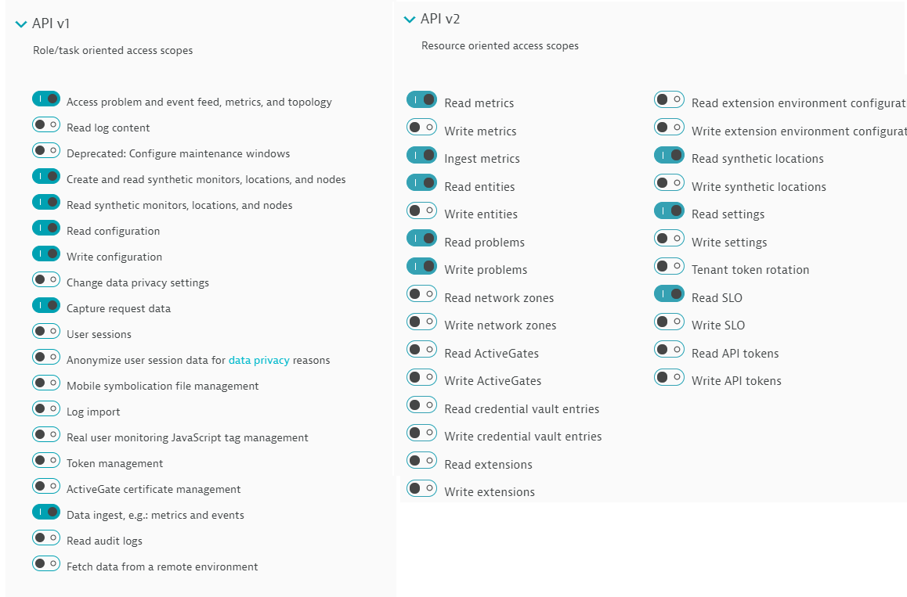
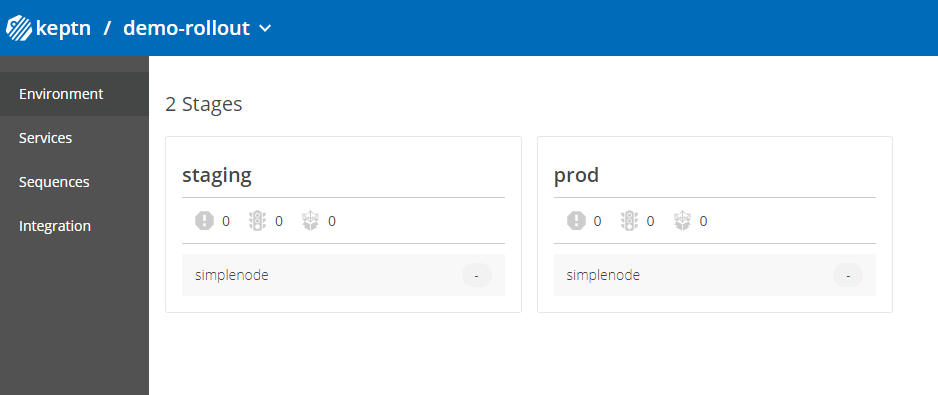
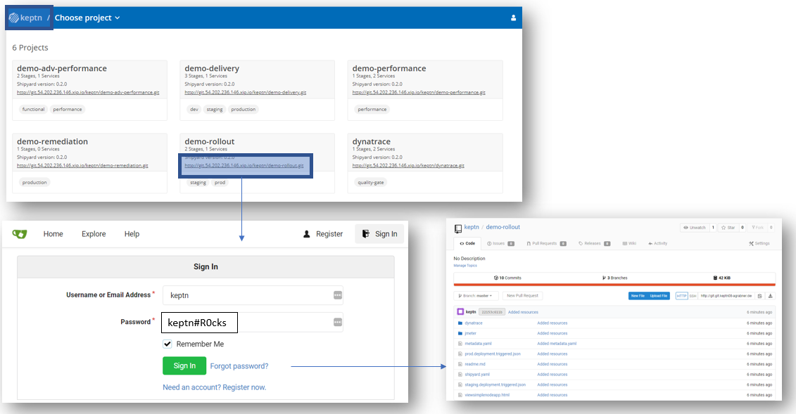
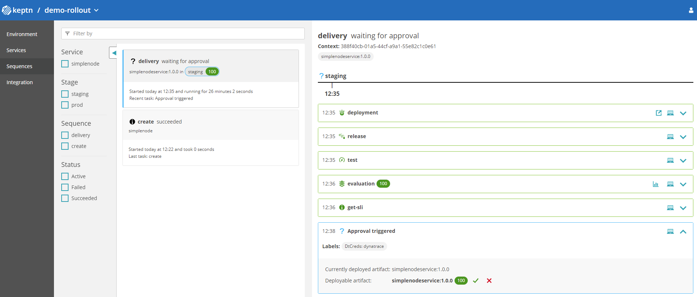
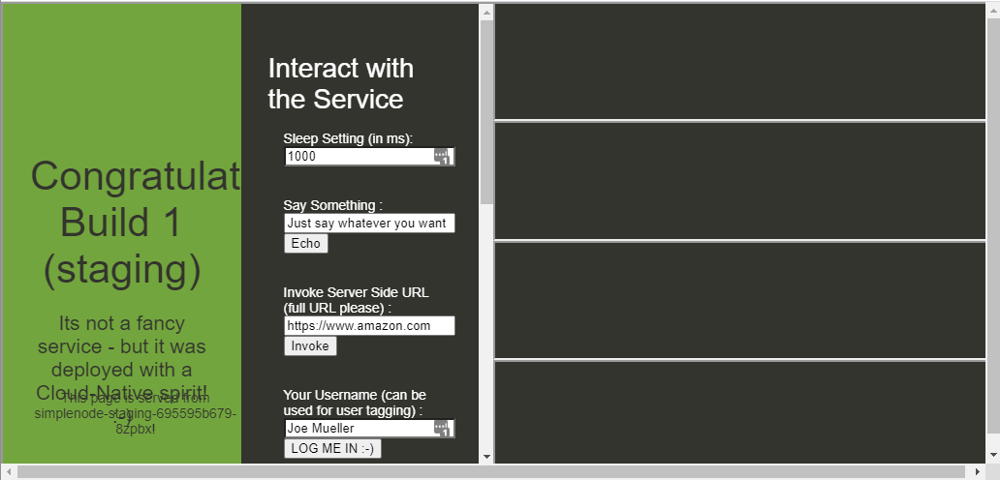
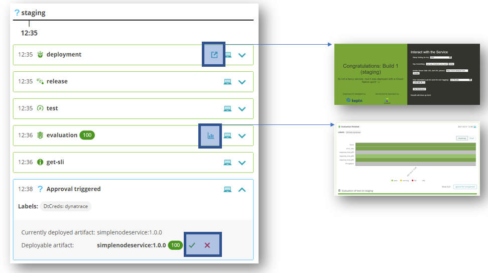
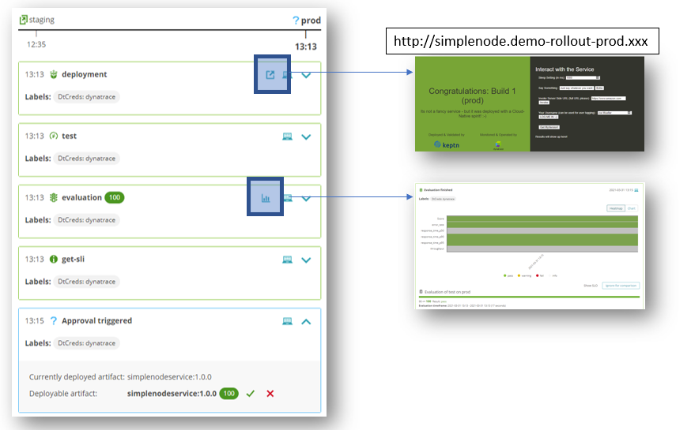
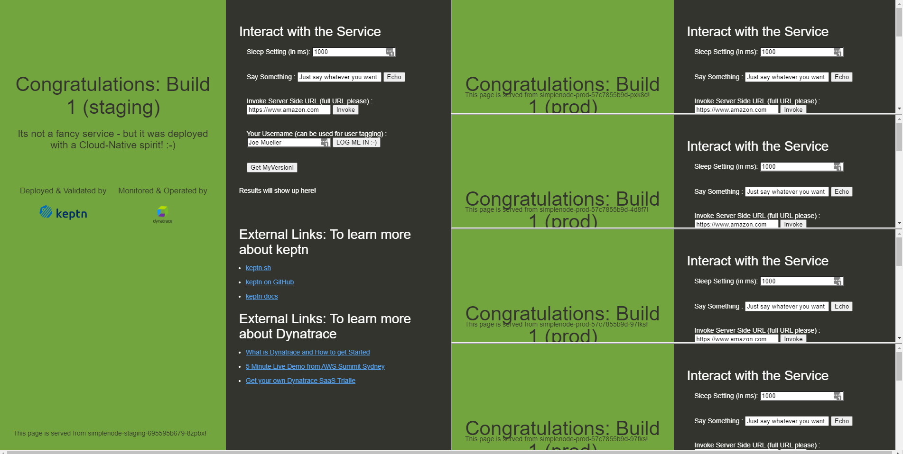
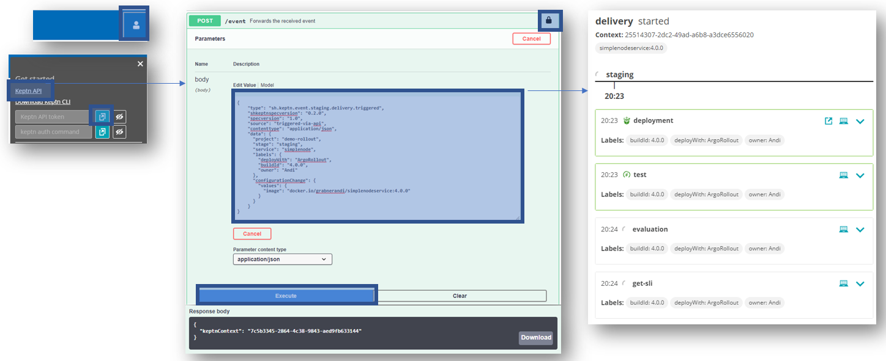
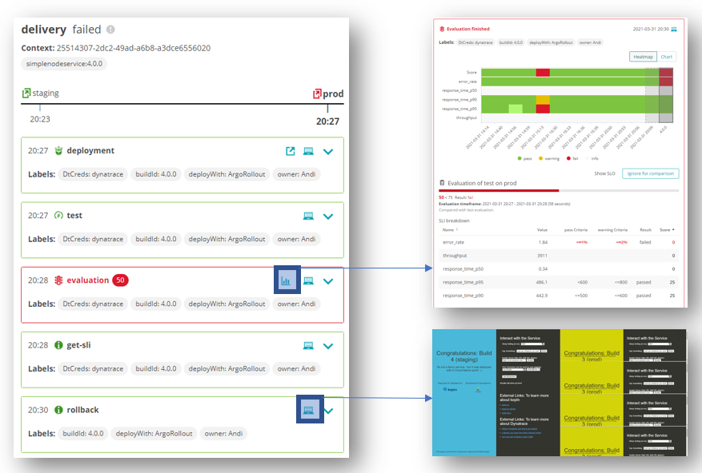

summary: 5 minute installation. All running on K3s with a single line installation. No Kubernetes cluster needed.
id: keptn-argo-rollouts-dynatrace-08-on-k3s
categories: Dynatrace,k3s,argo,canary
tags: keptn08x,introduction
status: Published
authors: Andreas Grabner
Feedback Link: https://github.com/keptn/tutorials/tree/master/site/tutorials


# Keptn Multi Stage Delivery with Argo Rollouts and Dynatrace on k3s

## Welcome
Duration: 2:00

Watch the intro in this YouTube video to see what this tutorial includes:


**Canary deployments** are a very popular progressive delivery model where new versions of a software component is safely released in a "phased" approach (e.g: 25%, 50%, 75%, 100% of traffic) instead of a big bang (100% of traffic). Between each phase an evaluation takes place deciding on whether to continue with the next phase of rolling out the canary to more end users or whether to roll it back to the previous version.

[Argo Rollouts](https://argoproj.github.io/argo-rollouts/) is a very popular open source progressive delivery controller for Kubernetes (k8s) and provides both Blue/Green as well as Canary rollout models. If you want to learn more check out their [introduction video of Argo Rollouts](https://www.youtube.com/watch?v=hIL0E2gLkf8)

### Why Keptn with Argo Rollouts?

Argo Rollouts is clearly a great and proven choice when it comes to managing Blue/Green or Canary rollouts. 


And while Argo Rollouts include an analysis component to control the rollout itself by analyzing metrics from external tools (Prometheus, Kayenta, Wavefront ...) it lacks other capabilities that require to integrate and automate Argo Rollout into other tools that can cover:
* Pre-validate environment
* Automated observability configuration
* Analysis based on more complex SLOs
* Analysis against previous timeframes
* Analysis result based promotion type (manual vs automated)
* Visualization of canary analysis
* Automated testing as part of rollout
* Status notifications of rollout progress
* Integrate approval process into ChatOps

### The best of both worlds: Keptn managing Argo Rollouts


Keptn's event-driven and open standard approach to delivery automation allows us to take the best of both worlds:
* Argo Rollouts: Blue / Green & Canary
* Keptn: Advanced SLO-based Quality Gates between Rollout Steps
* Keptn: SLO-based approval strategies (manual & automated)
* Keptn: Visualization of Rollout Status & Quality Gates
* Keptn: Automate Testing of each canary
* Keptn: Integrate into your ChatOps tools
* Keptn: Multi-Stage Delivery Support

So - lets get started with our tutorial!


## Prepare Installation of Keptn on k3s
Duration: 5:00

We have an extensive [Keptn on k3s](https://github.com/keptn-sandbox/keptn-on-k3s) tutorial on GitHub that includes setting up k3s, installing Keptn and automatically creating several Keptn projects to demo different use case with Dynatrace.
In this tutorial we focus on the Delivery Use Case using Argo Rollouts with Dynatrace as Observability Platform. If you want to explore more check out other tutorials on https://tutorials.keptn.sh or check out the full tutorial details on [Keptn on k3s](https://github.com/keptn-sandbox/keptn-on-k3s)

### Pre-Requs

**Linux Machine**
As we are going to deploy an app in multiple stages as well as in multiple replicas we need a machine that can not only run keptn but can be used to run our app as well.
You should therefore have a Linux machine with at least 8vCPUs and 32GB of RAM, e.g: EC2 t3.2large. As for storage - please have at least 30GB of storage
As we will be accessing Keptn via HTTP and HTTPS make sure that both ports (80 & 443) are allowed by your firewall.
What we will need is SSH access to this machine and SUDO rights so we can execute our scripts

So - here is our checklist:
- [x] Large enough Linux Machine
- [x] Ports 80 & 443 are open
- [x] SSH access and SUDO rights

**Dynatrace Environment**
Next thing we need is a Dynatrace environment. If you don't have one - just sign up for a [Dynatrace SaaS Trial](https://dynatrace.com/trial). As this is a tutorial includes automated rollout decisions based on SLOs (Service Level Objectives) we use Keptn to pull this data from Dynatrace as Dynatrace will automatically monitor our k3s cluster including every app we deploy on it. 

*1: API Token: DT_API_TOKEN*
For our Keptn installation we need a Dynatrace API Token that Keptn can use to query data as well as push some dashboards. 
For that - please create an API token (via Settings -> Integration -> Dynatrace API) with the following privileges. Make sure you copy that API Token in a safe spot:



*2: PaaS Token: DT_PAAS_TOKEN*
We also need a Dynatrace PaaS Token that allows our install script to install a Dynatrace OneAgent on k3s to also monitor that k3s cluster automatically. For that go to Settings -> Integration -> Platform as a Service and create a new token!

*3: Your Dynatrace Tenant Host: DT_TENANT*
If you have a Dynatrace SaaS (e.g: trial) environment we need the host name, e.g: abc12345.live.dynatrace.com. If you run Dynatrace Managed then we need the host + environment id, e.g: yourmanageddomain.com/e/YOUR-ENV-ID

*4: Your Dynatrace username: OWNER_EMAIL*
This should be simple. The username you have when logging in to Dynatrace. That is probably your email. We need that because a dashboard will be created automatically for us and every dashboard needs an owner. This is why we need that email!

So - here is our checklist:
- [x] DT_API_TOKEN
- [x] DT_PAAS_TOKEN
- [x] DT_TENANT
- [x] OWNER_EMAIL

### Preparing our Linux Host

Now that we have all data we can start with the installation

**Installing additional command line tools**
The installation script of our tutorial needs a couple of tools as those scripts will download some additional files (via curl), will parse some files (jq, yq), will iterate through file system (tree). We will also need git to download a git repo. Here is a list of all these tools and how you could install them if you have yum. For other Linux distributions please check how to install these tools: git, curl, jq, tree, yq

```console
sudo yum update -y
sudo yum install git -y
sudo yum install curl -y
sudo yum install jq -y
sudo yum install tree -y
sudo wget https://github.com/mikefarah/yq/releases/download/v4.2.0/yq_linux_amd64 -O /usr/bin/yq && sudo chmod +x /usr/bin/yq
```

**Download (git clone) the tutorial**
As mentioned, the [Keptn on k3s](https://github.com/keptn-sandbox/keptn-on-k3s) is a broad tutorial. While we are only using parts of it we simply download the whole thing locally which also includes the actual installation script. To do that we simply do a git clone and switch to the release-0.8.0 branch of that tutorial:

```console
git clone https://github.com/keptn-sandbox/keptn-on-k3s
cd keptn-on-k3s
git checkout release-0.8.0
```

## Installing Keptn on k3s for Argo Rollouts use cases
Duration: 5:00

We are almost ready to run our installation script. The only thing left to do is to export some of our data we prepared earlier (token, endpoints ...) via env-variables so the script can easily pick it up. Additionally to the 4 variables we prepared we also `export LE_STAGE=staging` - this will allow us to get a LetsEncrypt staging certificate so we can use TLS encryption.

Now - here is what you should export - obviously with the values that you have collected:
```console
$ export DT_TENANT=abc12345.live.dynatrace.com
$ export DT_API_TOKEN=YOUR_API_TOKEN
$ export DT_PAAS_TOKEN=YOUR_PAAS_TOKEN
$ export OWNER_EMAIL=yourdynatraceuser@yourmail.com
$ export LE_STAGE=staging
``` 

The installation scripts has multiple options - here is the one that will install the full tutorial which installs Keptn's Delivery Plane and a handful of sample projects including the `demo-rollout` project which showcases the Argo Rollout use case!

**BE AWARE** there is an option called --provider. If you run on e.g: EC2 then specify aws. If your machine is hosted on GCP then specify gcp. If you just run on a local machine or a VM you can omit that parameter!

```console
./install-keptn-on-k3s.sh --deliveryplane --provider aws --with-dynatrace --with-demo dynatrace --letsencrypt --with-gitea
```

**Use your own Domain Name (SUGGESTED)**
By default the installation will use your local IP and a free DNS Resolution service from xip.io to use proper DNS names. That works well but we have learned that it might sometimes be a bit unstable. You can create your own DNS, eg.: using Route53 to point to your public IP and then pass this domain name via the parameter --fqdn. Here would be the installation option to install the quality gates with a custom domain!
```console
./install-keptn-on-k3s.sh --deliveryplane --provider aws --with-dynatrace --with-demo dynatrace --letsencrypt --with-gitea --fqdn yourdomain.abc
```
I TRULY ENCOURAGE you to get your own DNS as it is simply more stable!


---

At the end of the installation the script outputs information about the installation and about each demo that was installed. Important for our tutorial is the output that looks like this as it contains all information on how we can access Keptn:
```
#######################################>
# Keptn Deployment Summary
#######################################>
API URL   :      https://keptn.YOUR.IP.xip.io/api
Bridge URL:      https://keptn.YOUR.IP.xip.io/bridge
Bridge Username: keptn
Bridge Password: YOURBRIDGEPASSWORD
API Token :      YOURKEPTNAPITOKEN
Git Server:      http://git.YOUR.IP.xip.io
Git User:        keptn
Git Password:    keptn#R0cks
```

Additionally take note of the Dynatrace Demo Summary block. There is a section covering the Argo Rollout Demo
```
#######################################>
# Dynatrace Demo Summary
#######################################>
6 Dynatrace Demo projects have been created, the Keptn CLI has been downloaded and configured and a first demo quality gate was already executed.

....
------------------------------------------------------------------------
For the Canary Delivery Use Case using Argo Rollouts we have created project demo-rollout that deploys a simplenode app in 2 stages (blue/green in staging and canary in prod)
To trigger a delivery simple do this
1: Trigger a delivery through the Keptn CLI or the Keptn API as explained in the readme
   keptn trigger delivery --project=demo-rollout --stage=staging --service=simplenode --image=docker.io/grabnerandi/simplenodeservice --tag=1.0.0
2: Watch the delivery progress in Keptn's bridge
   Project URL: https://keptn.YOUR.IP.xip.io/bridge/project/demo-rollout
   User / PWD: keptn / YOURBRIDGEPASSWORD
3: To deliver the next version simply run
   keptn trigger delivery --project=demo-rollout --stage=staging --service=simplenode --image=docker.io/grabnerandi/simplenodeservice --tag=2.0.0

```

### Access k3s
You can access k3s through the k3s cli that offers you full access to all kubectl commands. Like this
```
k3s kubectl get pods -A
```

If you want to use kubectl directly you can export the kubeconfig and then run the same command using kubectl like this:
```
export KUBECONFIG="/etc/rancher/k3s/k3s.yaml"
kubectl get pods -A
```

### Access Keptn's Bridge
To validate the installation went fine lets open Keptn's bridge by following the link to the Dynatrace project that was created for us. The url ends with /bridge/project/demo-rollout!



We see that this Keptn project uses a 2-stage shipyard file. In staging we will later see a Blue/Green Argo Rollout and in Prod we will see a Canary Argo Rollout.

You may notice that the URL ends with xip.io. We are using this free DNS service to leverage DNS names which also allows us to do some traffic routing on different domain names even though everything in the end resolves to your local IP. You will also notice that your browser tells you that the website is not secure even though you are accessing an https endpoint. This is because we created a temporary staging certificate using LetsEncrypt. If you want to use Keptn for production use cases you would need to create your own certificates. For our tutorial its OK though - you can just tell your browser to continue.
When you are prompted for username and password simply use bridge username & password that you find in the installation script output.

Now we are ready to do some actual deployments

### Access your Git Repos
Every keptn project internally holds a git repository containing all relevant files such as
1. Shipyard.yaml: defines all automation sequences
2. Helm charts: containing our Argo Rollout definitions
3. SLIs & SLOs: define which metrics to analyze during a rollout sequence
4. Test Files: define test cases, e.g: JMeter tests
5. Any other random files, e.g: we will find some helper html & json files for our tutorial

The tutorial comes with Gitea as a Git Web Service and every created Keptn project is linked to an upstream git repository in Gitea.
The easiest to access Gitea is therefore through Keptn's project overview page and then follow the link to the upstream git as shown here:


There is one helper file in the root directory of the main branch which is called `viewsimplenodeapp.html`. Please download that html file content locally and open that HTML in a browser. It will show us the actual deployed status of our simplenode app in staging and production. Initially it will not look like much because we haven't deployed anything yet. But - this is what you should see!


## Deploy version #1
Duration: 5:00

Now lets deploy version 1 of our simplenode app. Let's start by using the Keptn CLI. 
We simply copy/paste the command that was given to us by the installation script output:
```
keptn trigger delivery --project=demo-rollout --stage=staging --service=simplenode --image=docker.io/grabnerandi/simplenodeservice --tag=1.0.0
```

Once this is triggered we can watch the progress in the Keptn's Bridge. The best is to follow the event-driven sequences in the sequences screen. If everything goes according to plan the following steps happen:
1. Deployment will trigger a helm deployment including the Argo Rollout Blue/Green definition
2. Release will promote the Argo Rollout to become the active deployment
3. Tests will trigger a short JMeter test to test the application
4. Evaluation will get-sli's from Dynatrace and then calculated the SLO Score
5. Approval: If everything is we are asked to approve this build into production



If you keep an eye on your browser that has the local html file open we should see the first version deployed in staging (left frame)!


### Next steps for version 1?

From this view we have several options on next steps:


1. You can open the URL of the deployed app
2. You can explore the SLO analysis
3. You can approve version 1 into production

Please walk through all of those - especially the approval

Once we approve, Keptn will continue the sequences defined in the shipyard for the prod stage.
Deploying version 1 in prod looks almost the same as in staging. This is what you should see until you reach the approval:
1. Deployment will trigger a helm deployment including the Argo Rollout Canary definition
2. Tests will be triggered to validate that production is still healthy
3. Evaluation will get-sli's from Dynatrace
4. We could now approve to do the Canary rollout!

Now - Version 1 is very special because it is the first deployment and Argo Rollout by default simply rolls out a canary to 100% if it is the first deployment.
We could therefore continue the process by selecting YES in the approval step. But - we wont see a whole lot as the canary is already at 100%.

Therefore - lets just validate that you see exactly these steps, open the deployed link and evaluate the SLO results to make sure everything works as expected!


We can also see that the our local html file has picked up the production deployment by now (right frame)!


Now - lets do the same for version 2 to observe blue/green and canary deployments

## Deploy version #2
Duration: 5:00

Now that version 1 of our simplenode app is running in staging and production its time to truly see the value of blue/green and canary!
Lets trigger the delivery through the Keptn CLI as we have done it for build 1. Here is the command:
```
keptn trigger delivery --project=demo-rollout --stage=staging --service=simplenode --image=docker.io/grabnerandi/simplenodeservice --tag=2.0.0
```

This will kick off the delivery of version 2. You will see that it will fail in staging already as version 2 shows a high failure rate which results into a failed SLO evaluation.


Lets try version 3 and see if we have more luck!

## Deploy version #3
Duration: 5:00

Similar to version 2 we execute the following Keptn CLI command to trigger the delivery
```
keptn trigger delivery --project=demo-rollout --stage=staging --service=simplenode --image=docker.io/grabnerandi/simplenodeservice --tag=3.0.0
```

Version 3 is much better and should make it through the SLO Evaluation in staging. In order to promote it into production we simply approve it in the final step!
Now we sit and wait until Version 3 is fully rolled out. While this is happening you can keep watching our special local HTML file to see how gradually the canary gets rolled out to all incoming traffic!


Because build 3 should have no issues we should see it all the way going through alright!

## Deploy version 4 using API
Duration: 5:00

Now to our final version - version 4.
You can trigger it through the Keptn CLI if you want - but - to learn something new lets do it through the Keptn API. 
For that you can get the API Token from the top right menu where you can also get the link to the Swagger UI.
In the Swagger UI use the API Token for the authorization of the POST Event API Endpoint. Then click on "Try Out". This then allows you to define the API Body which we use to define the Keptn Cloud Event to trigger the delivery sequence in the staging stage for build 4.

Here is a rough overview of how this workflow looks like - below you find the details on the body to post into the edit field:


The Keptn CLI we used for our first three deployments basically sends a Keptn Cloud Event to the Keptn API endpoint. And that's exactly what we are doing here. We are triggering a sequence in a particular project, stage and for a particular service and we pass some additional meta data such as the new image we want to deploy or also some labels (which we can also pass through the CLI but haven't done yet).

To find the body please navigate to your Gitea UI for the demo-rollout project. In the main branch you will find a file called `staging.deployment.triggered.json`. This file contains the event that we want to send - already customized for your installation! It should look something like this:

```json
{
    "type": "sh.keptn.event.staging.delivery.triggered",
    "shkeptnspecversion": "0.2.0",
    "specversion": "1.0",
    "source": "triggered-via-api",
    "contenttype": "application/json",
    "data": {
      "project": "demo-rollout",
      "stage": "staging",
      "service": "simplenode",
      "labels": {
        "deployWith": "ArgoRollout",
        "buildId": "1.0.0",
        "owner": "Andi"
      },
      "configurationChange": {
        "values": {
          "image": "docker.io/grabnerandi/simplenodeservice:1.0.0"
        }        
      }
    }
}
```

Copy/Paste it from your gitea or even from here as it should be the same. Feel free to change the owner from Andi to some other name. 
Then click "Execute".
As response of the API call we receive the Keptn Context. This unique ID can be used for other API calls to e.g: query the status of the sequence. This makes it easy to integrate Keptn with other tools, e.g.: Trigger it from Jenkins, GitLab, Azure DevOps ...

What we should see is that Build 4 makes it into production but there is rejected and rolled back right after the initial deployment of the first canary step.


The reason this happens is because build 4 results in a higher error rate ONLY when run in production and is therefore a build we don't want to keep in production.


## Argo Rollouts with Keptn behind the scenes
Duration: 2:00

Argo Rollouts provide both Blue/Green and Canary deployments. For Canary you can define individual promotion steps.
Argo Rollouts provides its own evaluation mechanism to decide whether to roll forward or not. In our scenario we want Keptn to have full control over the canary rollout steps which is why we use the `pause` step option to hand control to Keptn.

Keptn's Argo-Service is the service that listens to Keptn's `release.started` event and will use this to promote the current canary to the next step.
In case of a problem the Argo-Service listens to keptn's `rollback.started` event and will use it to abort the canary.

For more details please have a look at the Helm Chart that you can find in the staging and prod namespace of your Keptn's Projects git repo.
Also have a detailed look at the shipyard.yaml of your project. As of Keptn 0.8.x we have to use individual sequences to model the steps for a canary rollout. That means that you have to have a keptn sequence for each rollout pause step in your rollout definition. The plan is that this will be made easier in future Keptn version!


## Troubleshooting
Duration: 0:00

Here some troubleshooting tips

### Lost your Keptn's bridge username / password

You can access this via the Keptn CLI. Just execute this:
```
keptn configure bridge -o
``` 

### Sometimes get Keptn CLI Errors

If you execute the Keptn CLI and receive an error like this ...
```
* Warning: could not check Keptn server version: Error connecting to server: Head https://keptn.YOUR.IP.xip.io/api: dial tcp: lookup keptn.YOUR.IP.xip.io on :53: no such host
Possible reasons:
* The Keptn API server is currently not available. Check if your Kubernetes cluster is available.
* Your Keptn CLI points to the wrong API server (verify using 'keptn status')
Starting to deliver the service simplenode in project demo-rollout in version docker.io/grabnerandi/simplenodeservice:2.0.0
Error: Error connecting to server: Head https://keptn.YOUR.IP.xip.io/api: dial tcp: lookup keptn.YOUR.IP.xip.io on :53: no such host
Possible reasons:
* The Keptn API server is currently not available. Check if your Kubernetes cluster is available.
* Your Keptn CLI points to the wrong API server (verify using 'keptn status')
```

This is most likely caused by a temporary issue with the free xip.io DNS resolver service we use. Simply try it again!

### Sometimes get browser errors when accessing bridge

This is possible as we are using xip.io as a free service to resolve DNS. If that temporarily fails it can have impact to either you accessing the bridge or the API. It can also have impact on Keptn itself. In that case - just retry!
To make this more stable - feel free to leverage your own DNS that you point to the public IP of your host and install the tutorial with the option --fqdn yourdomain.abc

### Installation of tutorial failed

Please contact us through the [Keptn slack workspace](https://slack.keptn.sh). We have a channel called #keptn-docs where you can directly ping us about issues on the tutorials


## Uninstall
Duration: 0:00

If you are done and want to uninstall the tutorial you can simply execute the following command
```console
k3s-uninstall.sh
``` 

This will delete the k3s cluster including keptn.
If you also want to delete the git repository content you can also delete the local directory keptn-on-k3s

## Other tutorials

If you want to explore other tutorials that are possible with this keptn on k3s demo then have a look at more tutorials on https://tutorials.keptn.sh (we are still developing some of them) - or explore the content on [Keptn on k3s](https://github.com/keptn-sandbox/keptn-on-k3s)

## Finish
Duration: 0:00

In this tutorial, you have learned how to use Keptn to automate multi-stage delivery using Argo Rollouts for Blue/Green and Canary.
The benefit that Keptn brings in is that it automates SLO validation, provides a promotion assistant, automates testing, integrates with your ChatOps tools, configures your monitoring and provides the automation across multi stages.

While this tutorial has used tools such as JMeter and Dynatrace you can easily replace it without any automation sequence changes with tools such as Locust or Prometheus.


### What we've covered

- Install Keptn and the sample project for Argo Rollouts
- Trigger delivery sequences through the Keptn CLI and API
- See SLO-based Evaluation in action
- How Argo Rollouts can be integrated with Keptn in terms of delivery, promotion and abort

{{ snippets/08/community/feedback.md }}
