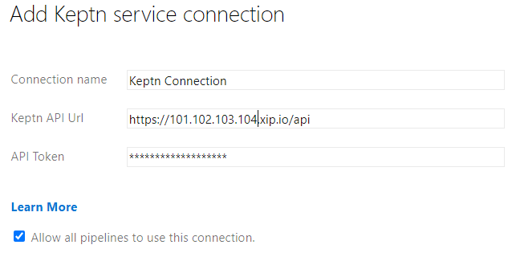
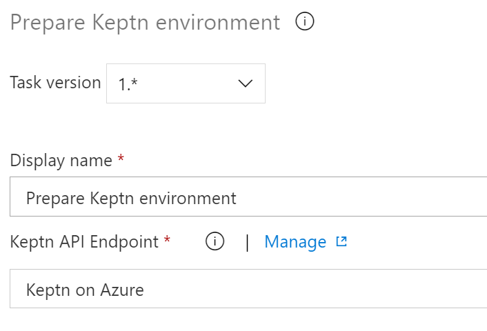
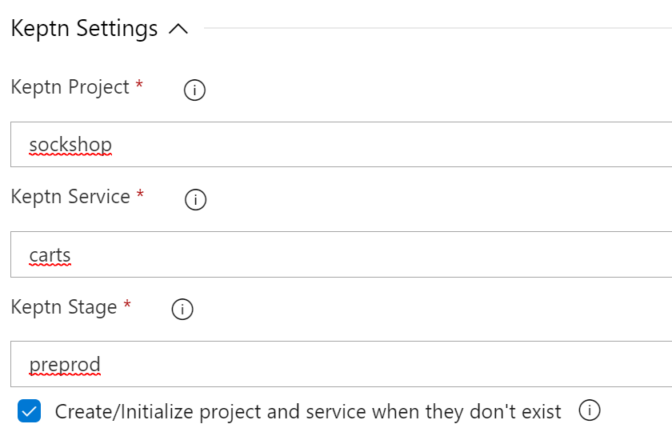
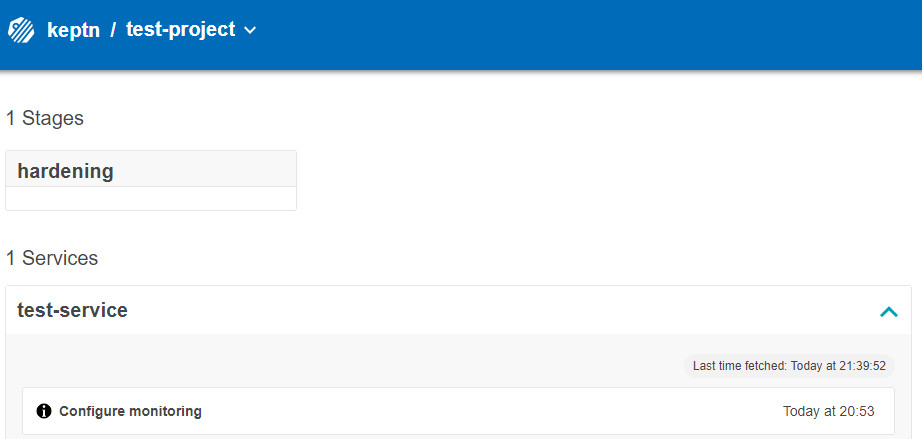
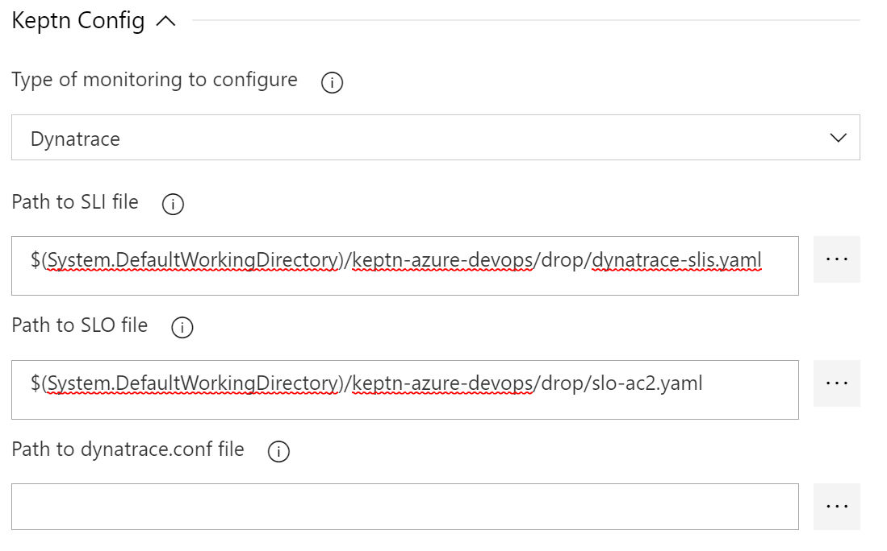
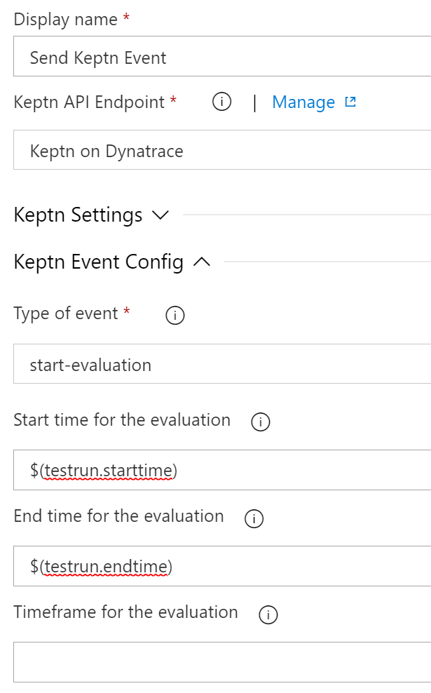
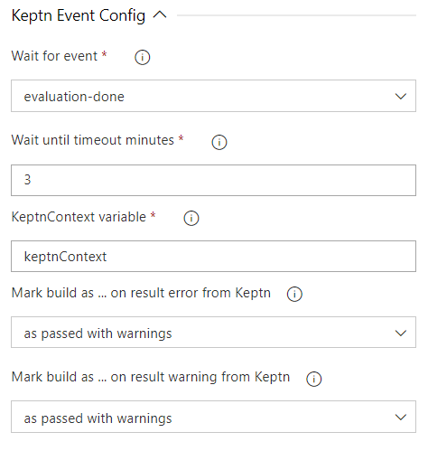

summary: Azure DevOps with Keptn
id: keptn-azure-devops-07
categories: AKS,quality-gates,dynatrace
tags: keptn07x
status: Submitted
authors: Jürgen Etzlstorfer, Bert Van der Heyden
Feedback Link: https://github.com/keptn/tutorials/tree/master/site/tutorials

# Azure DevOps Pipelines with Keptn Quality Gates

## Welcome
Duration: 00:02:00


In this tutorial, we are going integrate Keptn Quality Gates in your Azure DevOps release pipelines. 


### What you'll learn

1. Install Keptn for a quality gates use case on Azure Kubernetes Service (AKS)
1. Define Service Level Indicators (SLIs) to fetch metrics from Dynatrace
1. Define Service Level Objectives (SLOs) to verify quality of deployed services
1. Set up testing and evaluation pipeline in Azure DevOps
1. Install and integrate Keptn Integration Azure Devops Extension
1. Deploy app with Azure DevOps pipeline
1. See Keptn quality gates in action

We are going to use the **[Azure DevOps Keptn integration](https://github.com/keptn-sandbox/keptn-azure-devops-extension)** for this. This extension is also available on the Azure Devops Marketplace under the name **[Keptn Integration](https://marketplace.visualstudio.com/items?itemName=RealdolmenDevOps.keptn-integration)**

### Workflow

At the end of the tutorial, our environment will look like this:


## Prerequisites for tutorial
Duration: 2:00

- Access to [Azure DevOps](https://azure.microsoft.com/en-us/services/devops/) and permissions to create a project

- Have a Dynatrace tenant to monitor the application and we will use the Dynatrace data to validate the quality gate. You can [sign up for a free trial](https://www.dynatrace.com/trial/) (no credit card required).

- If you already have a working Keptn installation, you can jump directly to step [Configure Quality Gates](#config-quality-gates). You could make use of the [Keptn Quality Gates for Dynatrace on K3s](https://tutorials.keptn.sh/tutorials/keptn-quality-gates-dynatrace-07-on-k3s/index.html) tutorial. In this tutorial we will go further showing how Keptn Quality Gates could be installed into AKS. But for the use case itself it doesn't matter where keptn is installed. If you want to use a full Keptn installation on AKS, please use the [Keptn Installation on AKS](https://tutorials.keptn.sh/tutorials/keptn-installation-aks-07/index.html) tutorial.

{{ snippets/07/install/cluster-aks.md }}

{{ snippets/07/install/download-keptnCLI.md }}

## Install Keptn in your cluster
Duration: 5:00

To install the latest release of Keptn with _quality gate only capabilities_ in your Kubernetes cluster, execute the `keptn install` command.

```
keptn install --endpoint-service-type=ClusterIP --use-case=quality-gates
```

Positive
: The installation process will take about 3-5 minutes.

Positive
: Please note that Keptn comes with different installation options, all of the described in detail in the [Keptn docs](https://keptn.sh/docs/0.7.x/operate/install/).

### Installation details 

In the Keptn namespace, the following deployments should be found:

<!-- command -->
```
kubectl get deployments -n keptn
```

Here is the output of the command:

```
NAME                    READY   UP-TO-DATE   AVAILABLE   AGE
eventbroker-go          1/1     1            1           93d
api-gateway-nginx       1/1     1            1           93d
api-service             1/1     1            1           93d
bridge                  1/1     1            1           93d
mongodb                 1/1     1            1           93d
remediation-service     1/1     1            1           93d
mongodb-datastore       1/1     1            1           93d
lighthouse-service      1/1     1            1           93d
configuration-service   1/1     1            1           93d
shipyard-service        1/1     1            1           93d
```

{{ snippets/07/install/authCLI-clusterIP.md }}

{{ snippets/07/install/open-bridge.md }}

## <a name="config-quality-gates"></a>Configure Quality Gates
Duration: 4:00

When you use the K3s installation using the --with-dynatrace option, this step is already done. Otherwise we have to provide access to the Dynatrace tenant that will hold the data to Keptn. Therefore, please provide credentials for the Dynatrace SLI service to be able to fetch the metrics from Dynatrace.

The _Dynatrace tenant ID_ can be retrieved from the URL of your Dynatrace tenant. Please note that the tenant ID is the string between https:// and the first / after .com. 

Positive
: A valid tenant ID looks like: abc123.live.dynatrace.com 

Negative
: An invalid tenant ID looks like: https://abc123.live.dyntrace.com/

Retrieve the _Dynatrace API_ token by navigating to "Settings -> Integration -> Dynatrace API" and create a new API token. Assign a name, e.g. keptn, to it and for the purpose of this tutorial enable these permissions:

  - Access problem and event feed, metrics and topology
  - Access logs
  - Read configuration
  - Write configuration
  - Capture request data

Let's configure Keptn.

1. Define the credentials by adding them in a Kubernetes secret for the Keptn services to fetch. 
    **Important** replace `YOURTENANT` with your tenant id and `YOURAPITOKEN` with your actual Dynatrace API token.
    ```
    kubectl -n keptn create secret generic dynatrace --from-literal="DT_TENANT=YOURTENANT" --from-literal="DT_API_TOKEN=YOURAPITOKEN"
    ```
1. Install the Dynatrace SLI service
    ```
    kubectl apply -f https://raw.githubusercontent.com/keptn-contrib/dynatrace-sli-service/0.7.2/deploy/service.yaml
    ```

1. Install the Dynatrace service
    Although it's not required it is very usefull to install the Dynatrace service as it will configure your Dynatrace tenant to fully interact with the Keptn installation..
    ```
    kubectl apply -f https://raw.githubusercontent.com/keptn-contrib/dynatrace-sli/0.10.1/deploy/service.yaml
    ```

Note that we don't need to do anything else here since configuration of the monitoring, sli and slo will be done by the Azure DevOps extension.

## Deploy demo app 
Duration: 7:00

Let's now deploy our demo application. In our use case we are deploying the demo app on the same Kubernetes cluster that we are also using for our Keptn installation. We also need to monitor this application with Dynatrace to get input data for the Keptn Quality Gate. Let us start with deploying the app.

Move to the folder with the prepared manifests and apply them.

```
cd ../manifests
```

Create the namespace.
```
kubectl apply -f namespace.yaml
```
Create the database for the app.
```
kubectl apply -f carts-db.yaml
```
Deploy the demo application in version 1.
```
kubectl apply -f carts-v1.yaml
```

## Setup monitoring
Duration: 7:00

Let us now deploy the Dynatrace OneAgent on our cluster. Please note that this step can be automated if you choose the Keptn full installation!
The instructions how to install the Dynatrace OneAgent can be found on the [official Dynatrace documentation](https://www.dynatrace.com/support/help/technology-support/cloud-platforms/kubernetes/other-deployments-and-configurations/deploy-oneagent-on-kubernetes/), but are replicated here for ease of use.

Create the required objects for the OneAgent Operator:
```
kubectl create namespace dynatrace
kubectl apply -f https://github.com/Dynatrace/dynatrace-oneagent-operator/releases/download/v0.7.1/kubernetes.yaml
```

Create a secret with the needed tokens so that the OneAgent can be installed. You can create the tokens for Dynatrace in your Dynatrace tenant following these instructions:
    
1. Log in to your Dynatrace tenant and go to **Settings > Integration > Dynatrace API**. Then, create a new API token with the following permissions:

    - Access problem and event feed, metrics and topology
    - Access logs
    - Read configuration
    - Write configuration
    - Capture request data
    - Real user monitoring JavaScript tag management

1. Create a Dynatrace PaaS Token

  In your Dynatrace tenant, go to **Settings > Integration > Platform as a Service**, and create a new PaaS Token.

Now that you have the API_TOKEN and PAAS_TOKEN, execute the following command. Please make sure to replace the two placeholders `API_TOKEN` and `PAAS_TOKEN` with the actual token values. 
```
kubectl -n dynatrace create secret generic oneagent --from-literal="apiToken=API_TOKEN" --from-literal="paasToken=PAAS_TOKEN"
```

Next, let us download the custom resource for the Dynatrace OneAgent.

```
curl -o cr.yaml https://raw.githubusercontent.com/Dynatrace/dynatrace-oneagent-operator/release-0.7/deploy/cr.yaml
```

Now go ahead and open the file and **replace** the `apiUrl` with your actual URL of your Dynatrace tenant, e.g., https://abc1234.live.dynatrace.com/api and **save** the file.

Apply the custom resource to your cluster.

```
kubectl apply -f cr.yaml
```

Now you have successfully instrumented your Kubernetes cluster and the demo app with the Dynatrace OneAgent!
Before we check the service in our Dynatrace tenant, we are going to restart the demo app making sure it is instrumented by Dynatrace correctly.
```
kubectl delete pods --all -n preprod
```

Wait for all pods to show a ready status of 1/1 before proceeding, you can check with this command:
```
kubectl get pods -n preprod

NAME                        READY   STATUS    RESTARTS   AGE
carts-994869bb5-6msjc       1/1     Running   0          85s
carts-db-6656b66b4c-zw287   1/1     Running   0          85s
```

Negative
: Do not move on here until you have all pods up and running.


Last thing we need to make sure is to tag our demo application properly for the Keptn Quality Gates to query and evaluate the correct data. Therefore, first we first open the app to make sure it is running and then add tags on the app.

Execute the following script to generate some test traffic for the app (this might run a second or two).
```
curl --silent --output /dev/null "$(kubectl get svc carts -n preprod -ojsonpath='{.status.loadBalancer.ingress[0].ip}')/carts/[1-100]/items"
```

Next, open your Dynatrace tenant and navigate on to **Transactions and services** on the lefthand side. You should find a service called **ItemsController**. Click on it and add a tag named **keptn-qualitygates** like in the following screenshot.


## Prepare Azure DevOps
Duration: 8:00

### Create the project

1. Login to your [Azure DevOps environment](https://dev.azure.com/) and create a new project.

1. Name it, e.g., **keptn-qualitygate**. You can make it either public or private.
    

1. Retrieve the URL of the repo by moving to the *repo* section on the left-hand side menu. Generate the **Git credentials** here and save them somewhere for later. Click on **Initialize** at the end of this screen.

    

    This repo will hold as the config repo and we are going to need it a bit later.

1. Next, we are going to import all prepared resources we need into a new repository.
    

1. Use `https://github.com/keptn-sandbox/keptn-azure-devops-tutorial-scripts` as the import URL.
    

1. Clone the repo to your local machine to have all the files you need also locally. Click on the **Clone** button and generate a new Git token (this is different from the previous one). This time you can copy the full URL of the repo and execute something similar to the next snippet. Please replace the user and organization accordingly (or just copy your URL from the Azure platform).
    ```
    git clone https://juergenetzlstorfer@dev.azure.com/juergenetzlstorfer/keptn-qualitygate/_git/keptn-azure-devops
    ```
    When prompted, enter the Git token that you just copied.

### Install Keptn Integration Extension in Azure DevOps

First of all make sure to get the Keptn Integration extension from the Azure DevOps marketplace. (https://marketplace.visualstudio.com/items?itemName=RealdolmenDevOps.keptn-integration)
It's free and contains 4 tasks which make its easy to implement Keptn quality gates into your AZDO Release pipeline.

- Prepare Keptn environment
- Add Keptn resource
- Send Keptn event
- Wait for Keptn event


## Create SLI and SLO definitions
Duration: 10:00

### Define Service Level Indicators

Keptn uses monitoring data for Service-Level Indicators (SLIs) upon which we can define our quality gates. Therefore we are going to define which SLIs to use for our project. Keptn has already a built-in library of SLIs, however, we are going to use our custom SLIs for this tutorial. We assume we will be using our `carts` service in this tutorial, but feel free to use any service you want.
Just make sure that it's monitored by Dynatrace and has tags that match the SLI definition. In this case you see we use tag "keptn-qualitygates".

The file `dynatrace-slis.yaml` holds the following content, which are the API calls to Dynatrace to gather the data that is needed for evaluation for the quality gates. Please note that this file can be extended or changed, therefore making other SLIs available to your quality gates.

```
---
spec_version: '1.0'
indicators:
  throughput: "builtin:service.requestCount.total:merge(0):count?scope=tag(keptn-qualitygates)"
  error_rate: "builtin:service.errors.total.count:merge(0):avg?scope=tag(keptn-qualitygates)"
  response_time_p50: "builtin:service.response.time:merge(0):percentile(50)?scope=tag(keptn-qualitygates)"
  response_time_p90: "builtin:service.response.time:merge(0):percentile(90)?scope=tag(keptn-qualitygates)"
  response_time_p95: "builtin:service.response.time:merge(0):percentile(95)?scope=tag(keptn-qualitygates)"
```
Commit this file into the source repo of you Azure DevOps project, e.g. **keptn-qualitygate**. We will push it to keptn later on using the extension.

### Define Service Level Objectives

Now that we have defined our SLIs and how to retrieve them, we can build our Service-Level Objectives (SLOs) on top of that. In the `slo.yaml` we have defined an objective for the response time for the 95 percentile, named `response_time_p95`. 

```
---
spec_version: "0.1.1"
comparison:
  compare_with: "single_result"
  include_result_with_score: "pass"
  aggregate_function: "avg"
objectives:
  - sli: "response_time_p95"
    pass:             # pass if (relative change <= 10% AND absolute value is < 600ms)
      - criteria:
          - "<=+15%"  
          - "<600"    
    warning:          # if the response time is below 800ms, the result should be a warning
      - criteria:
          - "<=800"
  - sli: "throughput"   # sli without criteria are used for information only purposes
  - sli: "error_rate"
  - sli: "response_time_p50"
  - sli: "response_time_p90"
total_score:          # scoring based on all objectives
  pass: "90%"
  warning: "75%"
```

Again, commit this file into the source repo of your Azure DevOps project, e.g. **keptn-qualitygate**. We will push it to keptn later on using the extension.

## Create the build pipeline
Duration: 5:00

Since this is not an Azure DevOps tutorial we assume you already know how to create a build pipeline. The only important part is that you include the sli and slo yaml files we just created in the resulting published artifacts. Together with whatever else you will need. In our case we include some jmeter scripts as well. We named the build pipeline **keptn-azure-devops**.

```
---
steps:
- task: CopyFiles@2
  displayName: 'Copy Files to:  $(build.artifactstagingdirectory)'
  inputs:
    SourceFolder: '$(build.sourcesdirectory)'
    Contents: |
     azure/runTests.sh
     keptn-files/dynatrace-sli.yaml
     keptn-files/slo.yaml
    TargetFolder: '$(build.artifactstagingdirectory)'
    CleanTargetFolder: true
    OverWrite: true
    flattenFolders: true

steps:
- task: PublishBuildArtifacts@1
  displayName: 'Publish Artifact: drop'
  inputs:
    PathtoPublish: '$(build.artifactstagingdirectory)'

```

Positive
: Once you have defined this pipeline; you can already execute it and verify the published artifacts. It will also make it easier to continue with this tutorial if it has already been executed. 

## Create the release pipeline
Duration: 5:00

Please note that for the sake of simplicity, we are going to use the same cluster for our actual application where we also installed Keptn. But this would not be necessary and the Keptn Quality Gates installation could be on a different cluster, even in a different cloud. 

1. In the first step we are going to create a new release pipeline that we are using for testing and evaluating.
    

1. Select the template **Empty Job** since we don't need a predefined workflow and create a stage named **test & evaluate**.
    

1. We have already included all files we need for this tutorial into our repo. We are going to connect it to our pipeline. Click on **Add an Artifact** and select your repo as can be seen in the screenshot. Select **keptn-qualitygate** as the project, **keptn-azure-devops** as the source and the **master** as the default branch.
    

Within this release pipeline you can do whatever you need to do to deploy and test your service? In our case we have prepared a very simple test script. See next step.  

## Config release & test tasks
Duration: 3:00

1. Once we have the repo connected, we can go ahead and set up the pipeline, using the Kubernetes manifests from the repo. Click on **Tasks**, **test & evaluate** and add a new task. 

1. Next, we are going to add another task named "run tests" to the "**Test & Evaluate**" stage.

    

1. You will find a simple test script called `runTests.sh` in the `azure/` folder that sends a given number of HTTP requests to a given service endpoint. Please make sure to enter the correct script as well as the **testrun** reference name in the **Output Variables** section.

    

1. You also need to define a pipeline variable 
    - `NUM_OF_REQUESTS` = 1000

## Configure the Keptn tasks
Duration: 5:00

### Prepare Keptn environment
The first task we need to add to our pipeline after the test execution, or even before, is the Prepare Keptn environment task. It is very usefull since it prepares a project, stage and service for you. It also puts these entities as variables on the pipeline for later use by the other tasks. We will also let it configure the dynatrace monitoring here and push the [sli and slo](https://keptn.sh/docs/concepts/quality_gates/) files, which we created before, to Keptn.

1. The service endpoint
    First of all you need to configure the Keptn endpoint as a [`service connection`](https://docs.microsoft.com/en-us/azure/devops/pipelines/library/service-endpoints?view=azure-devops&tabs=yaml).

    

    All you need to configure is the API endpoint and the token. Note that the api endpoint structure has changed from version 0.7 from keptn onwards.
    > **Tip:** You can get the token from the upper right corner in the keptn's bridge.

    

1. We also define the Keptn Project, Keptn Service ans Keptn Stage here. In our demo we use **sockshop** as project, **carts** as service and **preprod** as stage.

    

1. We need to check the flag to Create/Initalize. This will make sure that Keptn get's configured correctly. After execution you will see following in the keptn bridge if the project did not yet exist.

    

1. In the Keptn Config section, we will select **Dynatrace** and select the sli and slo file which are available from the build pipeline. 

    


Positive
: Please note that the Keptn Integration extension also contains a task to "Add any Resource" to Keptn which could be used here. But to make things simple, the SLI, SLO and optionally the Dynatrace config files are directly uploaded via this Prepare task.

### Send Keptn event

Next we will be sending the start-evaluation cloud event to Keptn which triggers Lighthouse and performs the automatic validation of our tests.

1. Off course you need to select the Keptn API Endpoint again which is already available.

1. The project, service and stage can be filled in again with the same values as before, but you could also just leave them empty since the **prepare task** puts them in variables which are automatically picked up by this **send event** task.

1. start-evaluation requires some extra parameters:
    - `startTime`: format needs to be "yyyy-MM-ddTHH:mm:sszzz"
    - `endTime`: format needs to be "yyyy-MM-ddTHH:mm:sszzz"
    - `timeframe`: If you don't want to use start and end time you could for example provide "15m" as value to evaluate the previous 15 minutes.
    In this case we would just fill out start and end with variables $(starttime) and $(endtime) which are automatically set by the runTests.sh script.

Negative
: If you enter a start and end timestamp manually, for some reason Azure DevOps changes the date format. Which is not recognized by Keptn.



### Wait for Keptn event

The last task you need to add is **Wait for Keptn Event**.

This task listens for some time for a specific Keptn event. Currently only evaluation-done is supported. It waits for a configurable amount of minutes. Prerequisite of this task is the Send Keptn Event task which puts the keptnContext as a variable on the pipeline. This task uses this variable to capture the result.



You can configure what should happen with the pipeline on a warning or fail from keptn. In this case it will give a warning whenever the lighthouse service did not indicate a 'pass'. So both warning as fail in [Keptn][keptn_link] will result in a 'succeeded with issues' here.

## Run the deployment & quality gate
Duration: 4:00

Now that we have everything in place, we can run a test and check the evaluation of the quality gate.

Start the pipeline by clicking on **Create release**. The Azure DevOps pipeline will start to run the tests and then evaluate the quality gate.

Take a look at the logs for the Quality Gate evaluation and you will see the quality gate passed:


Let us now apply a new version of the application from the `manifest/ ` folder.

```
kubectl apply -f carts-v2.yaml
```

After the deployment to the preprod stage we again run the Keptn Quality Gate in our Azure Devops pipeline and watch check the result in the logs:


We can see that the quality gate evaluation has failed! Before we investigate why is has failed, let us run another version and do the evaluation.

```
kubectl apply -f carts-v3.yaml
```

We can investigate all evaluations of the quality gates in the Keptn's bridge - it is the UI with all details of Keptn workflows for all services and stages. We have made the bridge publicly available earlier. Open it in a browser and take a look at all the evaluation details we can see there.


Promote or decline promotion of artifact? Now you can decide based on the score of the Keptn quality gate if you want to promote the artifact to the next stage or if you want to take other actions like rolling back, stopping a canary or whatever actions your deployment strategy offers you.


## Summary
Duration: 1:00

### What we've covered 

1. We created a pipeline with tests and the Keptn quality gate
1. We configured Dynatrace as an SLI provider
    ```
    ---
    spec_version: '1.0'
    indicators:
    throughput: "builtin:service.requestCount.total:merge(0):count?scope=tag(keptn-qualitygates)"
    error_rate: "builtin:service.errors.total.count:merge(0):avg?scope=tag(keptn-qualitygates)"
    response_time_p50: "builtin:service.response.time:merge(0):percentile(50)?scope=tag(keptn-qualitygates)"
    response_time_p90: "builtin:service.response.time:merge(0):percentile(90)?scope=tag(keptn-qualitygates)"
    response_time_p95: "builtin:service.response.time:merge(0):percentile(95)?scope=tag(keptn-qualitygates)"
    ```
1. We created a SLO file with the quality gate definition
    ```
    ---
    spec_version: "0.1.1"
    comparison:
    compare_with: "single_result"
    include_result_with_score: "pass"
    aggregate_function: "avg"
    objectives:
    - sli: "response_time_p95"
        pass:             # pass if (relative change <= 10% AND absolute value is < 600ms)
        - criteria:
            - "<=+15%"  
            - "<600"    
        warning:          # if the response time is below 800ms, the result should be a warning
        - criteria:
            - "<=800"
    - sli: "throughput"   # sli without criteria are used for information only purposes
    - sli: "error_rate"
    - sli: "response_time_p50"
    - sli: "response_time_p90"
    total_score:          # scoring based on all objectives
    pass: "90%"
    warning: "75%"
    ```
1. We deployed and evaluated a version that passed the quality gate
    

1. We deployed and evaluated a version that did not pass the quality gate
    

1. We investigated the evaluations in the Keptn's bridge
    


{{ snippets/07/community/feedback.md }}
