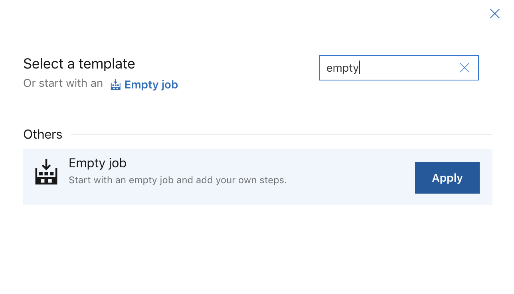
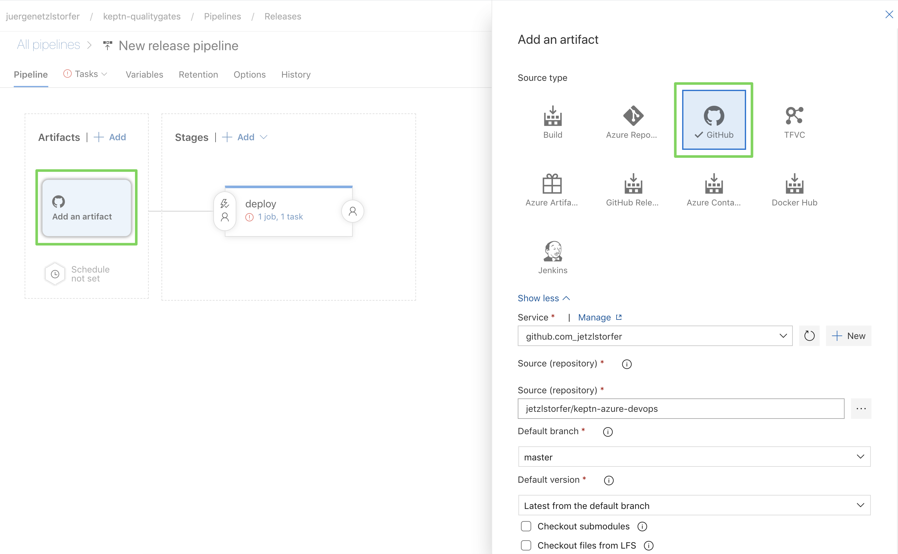

summary: Azure DevOps with Keptn
id: keptn-azure-devops
categories: AKS,quality-gates
tags: keptn06x
status: Submitted
authors: Jürgen Etzlstorfer
Feedback Link: https://github.com/keptn/tutorials/tree/master/site/tutorials

# Azure DevOps Pipelines with Keptn Quality Gates

## Welcome
Duration: 00:02:00


In this tutorial, I'm going to describe a way how to integrate Keptn Quality Gates in your Azure DevOps release pipelines. As there might be multiple ways how to do this, I will show you one that works easy and straight-forward to help you get started.


### What you'll learn

1. Install Keptn for quality gates only use case on Azure Kubernetes Service (AKS)
1. Create a project and service in Keptn
1. Define Service Level Indicators (SLIs) to fetch metrics from Dynatrace
1. Define Service Level Objectives (SLOs) to verify quality of deployed services
1. Set up release pipeline in Azure DevOps
1. Deploy app with Azure DevOps pipeline
1. See Keptn quality gates in action

### Workflow

At the end of the tutorial, our environment will look like this:


## Prequisites
Duration: 5:00

- Fork the Github repository to your personal Github account: https://github.com/keptn-sandbox/keptn-azure-devops

- Have a Dynatrace tenant to monitor the application and we will use the Dynatrace data to validate the quality gate. You can [sign up for a free trial](https://www.dynatrace.com/trial/) (no credit card required).

{{ snippets/install/cluster-aks.md }}

## Install Keptn
Duration: 7:00

Once we have the cluser for Keptn, we are going to install Keptn on it.
Open your favourite terminal and execute the following steps.

1. Get the Keptn CLI from Keptn.sh
    ```
    curl -sL https://get.keptn.sh | sudo -E bash
    ```
    This will download the Keptn CLI for your operating system and put it into `usr/local/bin/keptn`.

1. Now install Keptn on the AKS cluster. We are going to use only the [Keptn Quality Gates Use Case](https://keptn.sh/docs/0.6.0/usecases/quality-gates/). 
    ```
    keptn install --platform=aks --use-case=quality-gates
    ```
    This command should run for about 5 minutes and install Keptn Quality Gates on your AKS cluster. 

1. Check if the installation was successful and also retrieve the public IP of your Keptn installation:
    ```
    keptn status
    ```
    Output (similar to this):
    ```
    Starting to authenticate
    Successfully authenticated
    CLI is authenticated against the Keptn cluster https://api.keptn.XXXXXXXXX.xip.io
    ```

1. Expose the Keptn's bridge to get access to the user interface of Keptn.

    ```
    TODO 
    ```
  
1. You can now access the your Keptn Bridge (it will be empty right now though):
    

Now Keptn is installed and the bridge is exposed we can start setting up a project and services!

## Create a Project
Duration: 7:00


We are going to create a project in Keptn which will hold one or more services. Therefore, please go ahead and create a project called `sockshop`. The definition of the project is held in the `shipyard.yaml` file and is quite simple in our case:

```
stages:
  - name: "preprod"
```


We can also link the project we are creating to a external git repository to have full visibility of all configuration files that are managed by Keptn. In my case I am using my personal Github account and personal access token to do access a repo I created for this tutorial. Please note that the repository has to already exist with at least one file, e.g., the default `readme.md` in it.

1. Switch into the directory with all Keptn files prepared for the tutorial:
    ```
    cd keptn-files
    ```

1. Create project with Keptn CLI.

    1. Option 1: Link it to a Github repository (make sure to change the `git-user`, `git-remote-url`, and `git-token` to your own values).
        ```
        keptn create project sockshop --shipyard=./shipyard --git-user=youruser --git-remote-url=https://github.com/youruser/your-sockshop.git --git-token=XXXXX
        ```
    1. Option 2: Do not link it to a Github repository (you can just copy paste)
        ```
        keptn create project sockshop --shipyard=./shipyard
        ```

1. Now we are going to create the shopping cart service within the project. We will need this service as we will later build our quality gates for it. Please note that Keptn will not be responsible for deploying this service. (For Keptn insiders: we would use the command `keptn onboard service` and the [Keptn full installation](https://keptn.sh/docs/0.6.0/installation/setup-keptn/#install-keptn) instead.)
    ```
    keptn create service carts --project=sockshop
    ```

## Define Service Level Indicators
Duration: 3:00

Keptn uses monitoring data for Service-Level Indicators (SLIs) upon which we can define our quality gates. Therefore we are going to define which SLIs to use for our project. Keptn has already a built-in library of SLIs, however, we are going to use our custom SLIs for this tutorial, therefore we add them to our `carts service already added to Keptn.
The file `dynatrace-slis.yaml` holds the following content, which are the API calls to Dynatrace to gather the data that is needed for evaluation for the quality gates. Please note that this file can be extended or changed, therefore making other SLIs available to your quality gates.

```
---
spec_version: '1.0'
indicators:
  throughput: "builtin:service.requestCount.total:merge(0):count?scope=tag(project:$PROJECT),tag(service:$SERVICE)"
  error_rate: "builtin:service.errors.total.count:merge(0):avg?scope=tag(project:$PROJECT),tag(service:$SERVICE)"
  response_time_p50: "builtin:service.response.time:merge(0):percentile(50)?scope=tag(project:$PROJECT),tag(service:$SERVICE)"
  response_time_p90: "builtin:service.response.time:merge(0):percentile(90)?scope=tag(project:$PROJECT),tag(service:$SERVICE)"
  response_time_p95: "builtin:service.response.time:merge(0):percentile(95)?scope=tag(project:$PROJECT),tag(service:$SERVICE)"
```

We are going to add the file via the Keptn CLI to our **carts** service in the **preprod** environment of our **sockshop** project.
```
keptn add-resource --project=sockshop --stage=preprod --service=carts --resource=./dynatrace-slis.yaml --resourceUri=dynatrace/sli.yaml
```


## Configure Quality Gates
Duration: 4:00

Now the file has been added, we have to provide access to the Dynatrace tenant that will hold the data to Keptn. Therefore, please provide credentials for the Dynatrace SLI service to be able to fetch the metrics from Dynatrace.

The _Dynatrace tenant ID_ can be retrieved from the URL of your Dynatrace tenant. Please note that the tenant ID is the string between https:// and the first / after .com. 

Positive
: A valid tenant ID looks like: abc123.live.dynatrace.com 

Negative
: An invalid tenant ID looks like: https://abc123.live.dyntrace.com/

Retrieve the _Dynatrace API_ token by navigating to "Settings -> Integration -> Dynatrace API" and create a new API token. Assign a new, e.g. keptn, to it and for the purpose of this tutorial enable all permissions.

1. Define the credentials:
    ```
    cd ../scripts

    ./defineDynatraceCredentials.sh
    ```
1. Install the Dynatrace SLI service
    ```
    ./installDynatraceSLIService.sh
    ```

Now the SLI service is installed, we will enable it for the **sockshop** project. This step is necessary, since different projects can have their own SLI provider.

```
./enableDynatraceSLIforProject.sh sockshop
```

## Define Service Level Objectives
Duration: 4:00

Now that we have defined our SLIs and how to retrieve them, we can build our Service-Level Objectives (SLOs) on top of that. In the `slo.yaml` we have defined an objective for the response time for the 95 percentile, named `response_time_p95`. 

```
---
spec_version: "0.1.1"
comparison:
  compare_with: "single_result"
  include_result_with_score: "pass"
  aggregate_function: "avg"
objectives:
  - sli: "response_time_p95"
    pass:             # pass if (relative change <= 10% AND absolute value is < 600ms)
      - criteria:
          - "<=+15%"  
          - "<600"    
    warning:          # if the response time is below 800ms, the result should be a warning
      - criteria:
          - "<=800"
  - sli: "throughput"   # sli without criteria are used for information only purposes
  - sli: "error_rate"
  - sli: "response_time_p50"
  - sli: "response_time_p90"
total_score:          # scoring based on all objectives
  pass: "90%"
  warning: "75%"
```

We are going to add the file via the Keptn CLI to our **carts** service in the **preprod** environment of our **sockshop** project:
```
cd ../keptn-files

keptn add-resource --project=sockshop --service=carts --stage=preprod --resource=./keptn-files/slo.yaml --resourceUri=slo.yaml
```

**Optional**: we can verify all our configuration in our Github repository (if we have linked it previously):
    We can see the added `slo.yaml` as well as the `dynatrace` folder that holds the added `sli.yaml` file.

  


## Set up Azure DevOps pipeline
Duration: 3:00

Please note that for the sake of simplicity, we are going to use the same cluster for our actual application where we also installed Keptn. But this would not be necessary and the Keptn Quality Gates installation could be on a different cluster, even in a different cloud. 

1. Login to your Azure DevOps Portal and create a new **organization** if you don't already have one:
[https://aex.dev.azure.com/](https://aex.dev.azure.com/)

1. Create a new **project** in your organization, e.g., name it **keptn-qualitygates**.
    

## Create release pipeline
Duration: 3:00

1. In the next step we are going to create a new release pipeline
    

1. Create a stage "deploy" and select the template of an "Empty Job" since we don't need a predefined workflow.
    

## Connect Github
Duration: 4:00

1. All files for this tutorial are provided in a Github repository which we are going to connect as well, to have the deployment files and other utility files ready for this example. Therefore, "Add" an Artifact on the left-hand side of the screen and select "Github" as the source type.

    - Set a service connection with your Github account
    - Search for the  Github repository in the list by clicking on the "..." dots. 
    - The settings should be simliar as shown here:
    

## Set up deployment & test pipeline
Duration: 3:00

1. Once we have Github connected, we can go ahead and set up the deployment part of the pipeline, using the Kubernetes manifests from the Github account.

    

    

1. Next, we are going to add another stage to "**Test & Evaluate**" the deployment. 

    

1. You will find a simple test script that send a given number of HTTP requests to a given service endpoint. The endpoint as well as the number of requests have to be configured in the **Variables** section, which we will set up just in a moment.

    

## Set up Keptn Quality Gate

1. Now we are going to set up the Keptn Quality Gate. Once triggered it will automatically reach out to the SLI provider (in our example this is Dynatrace) and will fetch all metrics defined in the SLO file. If there are objectives defined, the Keptn quality gate will evaluate the metrics and generate a score for each individual metric, as well as total score for the whole quality gate. 

    

    Let us take a look how the quality gate is implemented:

    ```
    TODO
    ```

1. Let us now set the variables for the tests & evaluation of the quality gates. We will need the following variables:

    - KEPTN_API_TOKEN
    - KEPTN_ENDPOINT
    - KEPTN_PROJECT
    - KEPTN_SERVICE
    - KEPTN_STAGE
    - SERVICE_URL
    - NUM_OF_REQUESTS

    


1. Promote or decline promotion of artifact: Now you can decide based on the score of the Keptn quality gate if you want to promote the artifact to the next stage or if you want to take other actions like rolling back, stopping a canary or whatever actions your deployment strategy offers you.

## Run the deployment & quality gate
Duration: 4:00

Deploy your artifact with your release pipeline. 
After the deployment, the second stage will start the tests followed by the evaluation of the quality gate.


## Summary
Duration: 1:00

TODO
