summary: Azure DevOps with Keptn
id: keptn-azure-devops
categories: AKS,quality-gates,dynatrace
tags: keptn06x
status: Submitted
authors: Jürgen Etzlstorfer
Feedback Link: https://github.com/keptn/tutorials/tree/master/site/tutorials

# Azure DevOps Pipelines with Keptn Quality Gates

## Welcome
Duration: 00:02:00


In this tutorial, I'm going to describe a way how to integrate Keptn Quality Gates in your Azure DevOps release pipelines. As there might be multiple ways how to do this, I will show you one that works easy and straight-forward to help you get started.


### What you'll learn

1. Install Keptn for a quality gates use case on Azure Kubernetes Service (AKS)
1. Create a project and service in Keptn
1. Define Service Level Indicators (SLIs) to fetch metrics from Dynatrace
1. Define Service Level Objectives (SLOs) to verify quality of deployed services
1. Set up testing and evaluation pipeline in Azure DevOps
1. Deploy app with Azure DevOps pipeline
1. See Keptn quality gates in action

### Workflow

At the end of the tutorial, our environment will look like this:


## Prerequisites for tutorial
Duration: 2:00

- Access to [Azure DevOps](https://azure.microsoft.com/en-us/services/devops/) and permissions to create a project

- Have a Dynatrace tenant to monitor the application and we will use the Dynatrace data to validate the quality gate. You can [sign up for a free trial](https://www.dynatrace.com/trial/) (no credit card required).

{{ snippets/install/cluster-aks.md }}

## Install Keptn
Duration: 7:00

Once we have the cluser for Keptn, we are going to install Keptn on it.
Open your favourite terminal and execute the following steps.

1. Get the Keptn CLI from [Keptn.sh](https://keptn.sh)
    ```
    curl -sL https://get.keptn.sh | sudo -E bash
    ```
    This will download the Keptn CLI for your operating system and put it into `usr/local/bin/keptn`.

1. Now install Keptn on the AKS cluster. We are going to use only the [Keptn Quality Gates Use Case](https://keptn.sh/docs/0.6.0/usecases/quality-gates/). 
    ```
    keptn install --platform=aks --use-case=quality-gates
    ```
    This command should run for about 5 minutes and install Keptn Quality Gates on your AKS cluster. 

1. Check if the installation was successful and also retrieve the public IP of your Keptn installation:
    ```
    keptn status
    ```
    Output (similar to this):
    ```
    Starting to authenticate
    Successfully authenticated
    CLI is authenticated against the Keptn cluster https://api.keptn.XXXXXXXXX.xip.io
    ```

1. Expose the Keptn's bridge to get access to the user interface of Keptn.

    ```
    keptn configure bridge --action=expose  
    ```
  
1. You can now access the your Keptn Bridge (it will be empty right now though):
    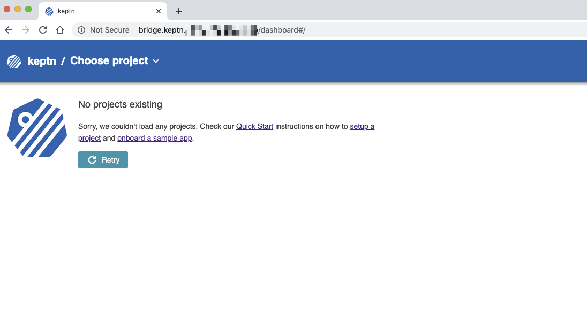

Now Keptn is installed and the bridge is exposed we can start setting up a project and services!

## Create a Project
Duration: 7:00

Keptn stores its configuration files in a Git repository. In this tutorial, we are going to use the Azure DevOps git to have all the Keptn configuration in one place. 

1. Login to your [Azure DevOps environment](https://dev.azure.com/) and create a new project.

1. Name it, e.g., **keptn-qualitygate**. You can make it either public or private.
    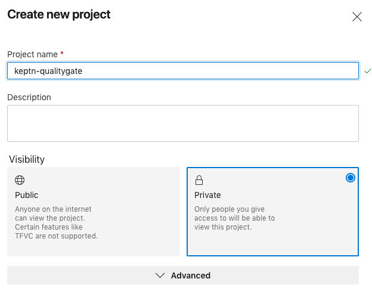

1. Retrieve the URL of the repo by moving to the *repo* section on the left-hand side menu. Generate the **Git credentials** here and save them somewhere for later. Click on **Initialize** at the end of this screen.

    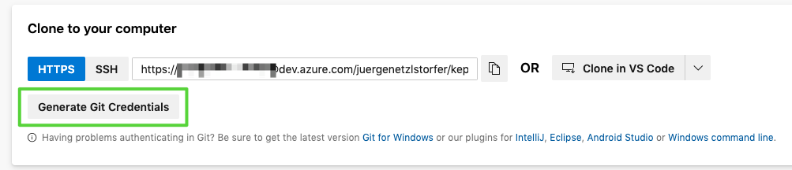

    This repo will hold as the config repo and we are going to need it a bit later.

1. Next, we are going to import all prepared resources we need into a new repository.
    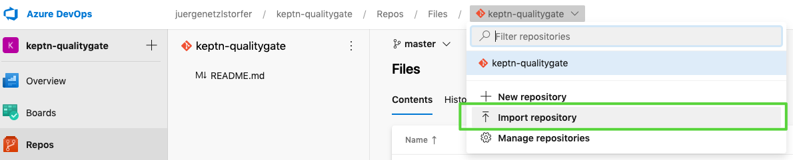

1. Use `https://github.com/keptn-sandbox/keptn-azure-devops` as the import URL.
    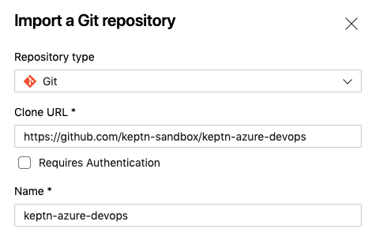

1. Clone the repo to your local machine to have all the files you need also locally. Click on the **Clone** button and generate a new Git token (this is different from the previous one). This time you can copy the full URL of the repo and execute something similar to the next snippet. Please replace the user and organization accordingly (or just copy your URL from the Azure platform).
    ```
    git clone https://juergenetzlstorfer@dev.azure.com/juergenetzlstorfer/keptn-qualitygate/_git/keptn-azure-devops
    ```
    When prompted, enter the Git token that you just copied.

Next, we are going to create a project in Keptn which will hold one or more services. Therefore, please go ahead and create a project called `sockshop`. The definition of the project is held in the `shipyard.yaml` file and is quite simple in our case:

```
stages:
  - name: "preprod"
```

We can also link the project we are creating to a DevOps git repository to have full visibility of all configuration files that are managed by Keptn. 

1. Switch into the directory with all Keptn files prepared for the tutorial:
    ```
    cd keptn-azure-devops/keptn-files
    ```

1. Create project with Keptn CLI.

    1. Option 1: Link it to a Azure DevOps Git repository (make sure to change the `git-user`, `git-remote-url`, and `git-token` to your own values).
    **Important**: we are using the Git config repo that we created in the first step of this page and NOT the one that we imported. Remove the User from the URL before passing it to Keptn - in more detail remove the part between https:// and dev.azure.com. For example, in the picture below the correct URL would be https://dev.azure.com/YOUR-ORG/keptn-qualitygate/_git/keptn-qualitygate. Also, make sure to use the correct token.
        ```
        keptn create project sockshop --shipyard=./shipyard.yaml --git-user=youruser --git-remote-url=https://dev.azure.com/YOUR-ORG/keptn-qualitygate/_git/keptn-qualitygate --git-token=XXXXX
        ```
    1. Option 2: Do not link it to a Git repository (you can just copy paste but the config repo won't be visible in your Azure Git repo)
        ```
        keptn create project sockshop --shipyard=./shipyard.yaml
        ```

1. Now we are going to create the shopping cart service within the project. We will need this service as we will later build our quality gates for it. Please note that Keptn will not be responsible for deploying this service. (For Keptn insiders: we would use the command `keptn onboard service` and the [Keptn full installation](https://keptn.sh/docs/0.6.0/installation/setup-keptn/#install-keptn) instead.)
    ```
    keptn create service carts --project=sockshop
    ```

## Define Service Level Indicators
Duration: 3:00

Keptn uses monitoring data for Service-Level Indicators (SLIs) upon which we can define our quality gates. Therefore we are going to define which SLIs to use for our project. Keptn has already a built-in library of SLIs, however, we are going to use our custom SLIs for this tutorial, therefore we add them to our `carts` service already added to Keptn.
The file `dynatrace-slis.yaml` holds the following content, which are the API calls to Dynatrace to gather the data that is needed for evaluation for the quality gates. Please note that this file can be extended or changed, therefore making other SLIs available to your quality gates.

```
---
spec_version: '1.0'
indicators:
  throughput: "builtin:service.requestCount.total:merge(0):count?scope=tag(keptn-qualitygates)"
  error_rate: "builtin:service.errors.total.count:merge(0):avg?scope=tag(keptn-qualitygates)"
  response_time_p50: "builtin:service.response.time:merge(0):percentile(50)?scope=tag(keptn-qualitygates)"
  response_time_p90: "builtin:service.response.time:merge(0):percentile(90)?scope=tag(keptn-qualitygates)"
  response_time_p95: "builtin:service.response.time:merge(0):percentile(95)?scope=tag(keptn-qualitygates)"
```

We are going to add the file via the Keptn CLI to our **carts** service in the **preprod** environment of our **sockshop** project.
```
keptn add-resource --project=sockshop --stage=preprod --service=carts --resource=./dynatrace-slis.yaml --resourceUri=dynatrace/sli.yaml
```


## Configure Quality Gates
Duration: 4:00

Now the file has been added, we have to provide access to the Dynatrace tenant that will hold the data to Keptn. Therefore, please provide credentials for the Dynatrace SLI service to be able to fetch the metrics from Dynatrace.

The _Dynatrace tenant ID_ can be retrieved from the URL of your Dynatrace tenant. Please note that the tenant ID is the string between https:// and the first / after .com. 

Positive
: A valid tenant ID looks like: abc123.live.dynatrace.com 

Negative
: An invalid tenant ID looks like: https://abc123.live.dyntrace.com/

Retrieve the _Dynatrace API_ token by navigating to "Settings -> Integration -> Dynatrace API" and create a new API token. Assign a name, e.g. keptn, to it and for the purpose of this tutorial enable these permissions:

  - Access problem and event feed, metrics and topology
  - Access logs
  - Read configuration
  - Write configuration
  - Capture request data

Let's configure Keptn.

1. Define the credentials by adding them in a Kubernetes secret for the Keptn services to fetch. 
    **Important** replace `YOURTENANT` with your tenant id and `YOURAPITOKEN` with your actual Dynatrace API token.
    ```
    kubectl -n keptn create secret generic dynatrace --from-literal="DT_TENANT=YOURTENANT" --from-literal="DT_API_TOKEN=YOURAPITOKEN"
    ```
1. Install the Dynatrace SLI service
    ```
    kubectl apply -f https://raw.githubusercontent.com/keptn-contrib/dynatrace-sli-service/0.4.1/deploy/service.yaml
    ```

1. Now the SLI service is installed, we will enable it for the **sockshop** project. This step is necessary, since different projects can have their own SLI provider.
    ```
    keptn configure monitoring dynatrace --project=sockshop --suppress-websocket
    ```

## Define Service Level Objectives
Duration: 4:00

Now that we have defined our SLIs and how to retrieve them, we can build our Service-Level Objectives (SLOs) on top of that. In the `slo.yaml` we have defined an objective for the response time for the 95 percentile, named `response_time_p95`. 

```
---
spec_version: "0.1.1"
comparison:
  compare_with: "single_result"
  include_result_with_score: "pass"
  aggregate_function: "avg"
objectives:
  - sli: "response_time_p95"
    pass:             # pass if (relative change <= 10% AND absolute value is < 600ms)
      - criteria:
          - "<=+15%"  
          - "<600"    
    warning:          # if the response time is below 800ms, the result should be a warning
      - criteria:
          - "<=800"
  - sli: "throughput"   # sli without criteria are used for information only purposes
  - sli: "error_rate"
  - sli: "response_time_p50"
  - sli: "response_time_p90"
total_score:          # scoring based on all objectives
  pass: "90%"
  warning: "75%"
```

We are going to add the file via the Keptn CLI to our **carts** service in the **preprod** environment of our **sockshop** project:
```
cd ../keptn-files

keptn add-resource --project=sockshop --service=carts --stage=preprod --resource=./slo.yaml --resourceUri=slo.yaml
```

**Optional**: we can verify all our configuration in our Config repository (if we have linked it previously):
  We can see the added `slo.yaml` as well as the `dynatrace` folder that holds the added `sli.yaml` file.

  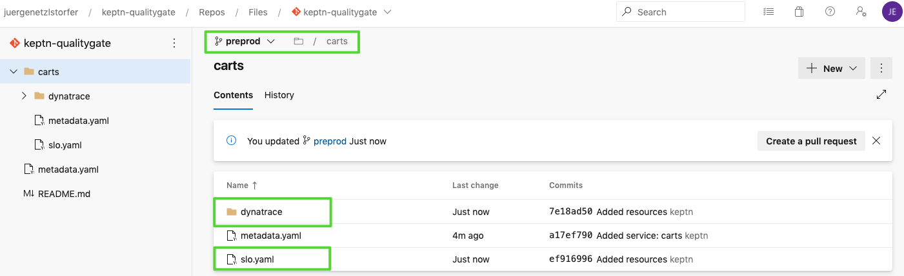

## Deploy demo app 
Duration: 7:00

Let's now deploy our demo application. In our use case we are deploying the demo app on the same Kubernetes cluster that we are also using for our Keptn installation. We also need to monitor this application with Dynatrace to get input data for the Keptn Quality Gate. Let us start with deploying the app.

Move to the folder with the prepared manifests and apply them.

```
cd ../manifests
```

Create the namespace.
```
kubectl apply -f namespace.yaml
```
Create the database for the app.
```
kubectl apply -f carts-db.yaml
```
Deploy the demo application in version 1.
```
kubectl apply -f carts-v1.yaml
```

## Setup monitoring
Duration: 7:00

Let us now deploy the Dynatrace OneAgent on our cluster. Please note that this step can be automated if you choose the Keptn full installation!
The instructions how to install the Dynatrace OneAgent can be found on the [official Dynatrace documentation](https://www.dynatrace.com/support/help/technology-support/cloud-platforms/kubernetes/other-deployments-and-configurations/deploy-oneagent-on-kubernetes/), but are replicated here for ease of use.

Create the required objects for the OneAgent Operator:
```
kubectl create namespace dynatrace
kubectl apply -f https://github.com/Dynatrace/dynatrace-oneagent-operator/releases/download/v0.7.1/kubernetes.yaml
```

Create a secret with the needed tokens so that the OneAgent can be installed. You can create the tokens for Dynatrace in your Dynatrace tenant following these instructions:
    
1. Log in to your Dynatrace tenant and go to **Settings > Integration > Dynatrace API**. Then, create a new API token with the following permissions:

    - Access problem and event feed, metrics and topology
    - Access logs
    - Read configuration
    - Write configuration
    - Capture request data
    - Real user monitoring JavaScript tag management

1. Create a Dynatrace PaaS Token

  In your Dynatrace tenant, go to **Settings > Integration > Platform as a Service**, and create a new PaaS Token.

Now that you have the API_TOKEN and PAAS_TOKEN, execute the following command. Please make sure to replace the two placeholders `API_TOKEN` and `PAAS_TOKEN` with the actual token values. 
```
kubectl -n dynatrace create secret generic oneagent --from-literal="apiToken=API_TOKEN" --from-literal="paasToken=PAAS_TOKEN"
```

Next, let us download the custom resource for the Dynatrace OneAgent.

```
curl -o cr.yaml https://raw.githubusercontent.com/Dynatrace/dynatrace-oneagent-operator/release-0.7/deploy/cr.yaml
```

Now go ahead and open the file and **replace** the `apiUrl` with your actual URL of your Dynatrace tenant, e.g., https://abc1234.live.dynatrace.com/api and **save** the file.

Apply the custom resource to your cluster.

```
kubectl apply -f cr.yaml
```

Now you have successfully instrumented your Kubernetes cluster and the demo app with the Dynatrace OneAgent!
Before we check the service in our Dynatrace tenant, we are going to restart the demo app making sure it is instrumented by Dynatrace correctly.
```
kubectl delete pods --all -n preprod
```

Wait for all pods to show a ready status of 1/1 before proceeding, you can check with this command:
```
kubectl get pods -n preprod

NAME                        READY   STATUS    RESTARTS   AGE
carts-994869bb5-6msjc       1/1     Running   0          85s
carts-db-6656b66b4c-zw287   1/1     Running   0          85s
```

Negative
: Do not move on here until you have all pods up and running.


Last thing we need to make sure is to tag our demo application properly for the Keptn Quality Gates to query and evaluate the correct data. Therefore, first we first open the app to make sure it is running and then add tags on the app.

Execute the following script to generate some test traffic for the app (this might run a second or two).
```
curl --silent --output /dev/null "$(kubectl get svc carts -n preprod -ojsonpath={.status.loadBalancer.ingress[0].ip})/carts/[1-100]/items"
```

Next, open your Dynatrace tenant and navigate on to **Transactions and services** on the lefthand side. You should find a service called **ItemsController**. Click on it and add a tag named **keptn-qualitygates** like in the following screenshot.

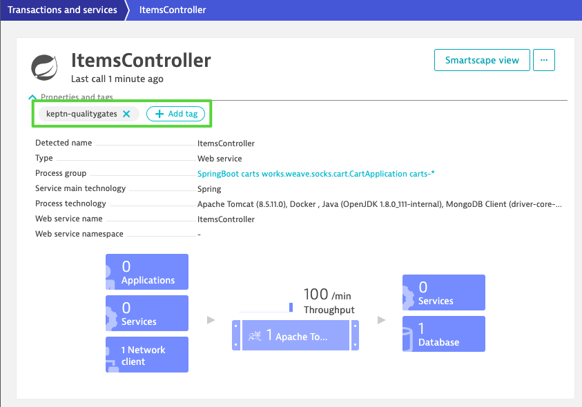


## Set up Azure DevOps pipeline
Duration: 3:00

Please note that for the sake of simplicity, we are going to use the same cluster for our actual application where we also installed Keptn. But this would not be necessary and the Keptn Quality Gates installation could be on a different cluster, even in a different cloud. 

1. In the first step we are going to create a new release pipeline that we are using for testing and evaluating.
    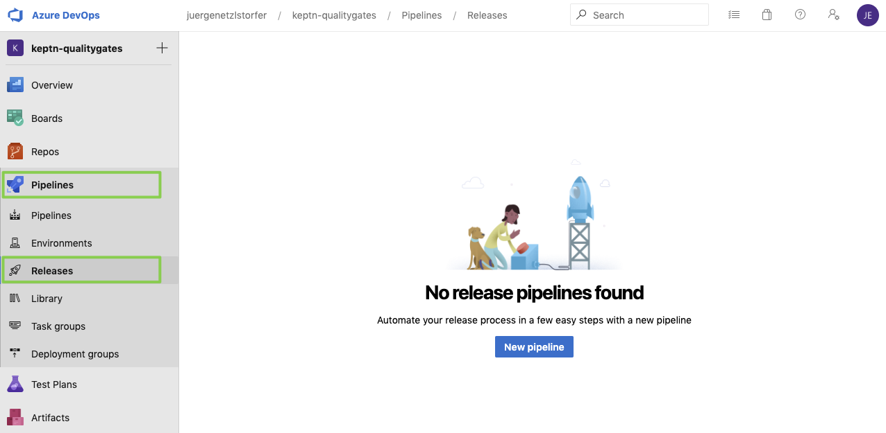

1. Select the template **Empty Job** since we don't need a predefined workflow and create a stage named **test & evaluate**.
    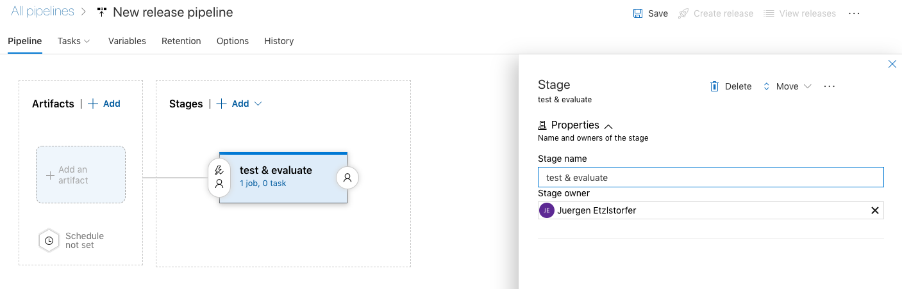

1. We have already included all files we need for this tutorial into our repo. We are going to connect it to our pipeline. Click on **Add an Artifact** and select your repo as can be seen in the screenshot. Select **keptn-qualitygate** as the project, **keptn-azure-devops** as the source and the **master** as the default branch.
    


## Config release & test pipeline
Duration: 3:00

1. Once we have the repo connected, we can go ahead and set up the pipeline, using the Kubernetes manifests from the repo. Click on **Tasks**, **test & evaluate** and add a new task. 

1. Next, we are going to add another task named "run tests" to the "**Test & Evaluate**" stage.

    

1. You will find a simple test script called `runTests.sh` in the `azure/` folder that sends a given number of HTTP requests to a given service endpoint. Please make sure to enter the correct script as well as the **testrun** reference name in the **Output Variables** section.

    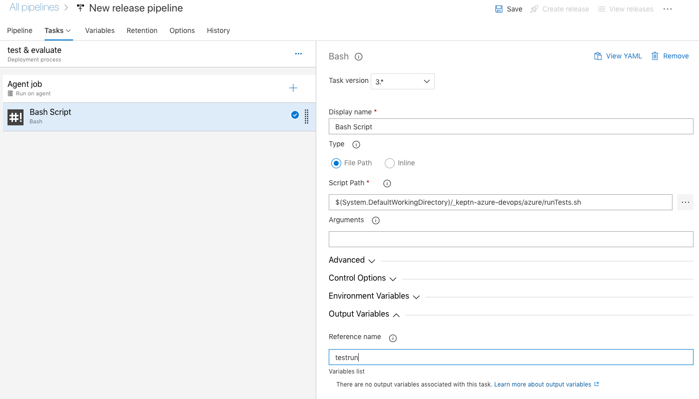

## Set up Keptn Quality Gate

1. Now we are going to set up the Keptn Quality Gate. Once triggered it will automatically reach out to the SLI provider (in our example this is Dynatrace) and will fetch all metrics defined in the SLO file. If there are objectives defined, the Keptn quality gate will evaluate the metrics and generate a score for each individual metric, as well as total score for the whole quality gate. 
Again, set up a a new step from a **Bash Script** that we call **keptn quality gate**. Select the corresponding file from the `azure` folder as the script path.

    

    The whole logic of the quality gate is implemented in a simple bash script named `quality-gate.sh` that you'll find in the `azure` folder. Add it in the script path of your pipeline task. 
    The script will trigger the evaluation of the quality gate, and then query the Keptn API for the result of the evaluation. Depending on the monitoring tool this might take some time for all data to be processed, thus this script might take up to 2-3 minutes.

1. Let us now set the variables for the tests & evaluation of the quality gates. We will need the following variables:

    - KEPTN_API_TOKEN see below
    - KEPTN_ENDPOINT see below
    - SERVICE_URL see below
    - KEPTN_PROJECT = sockshop
    - KEPTN_SERVICE = carts
    - KEPTN_STAGE = preprod
    - NUM_OF_REQUESTS = 1000

    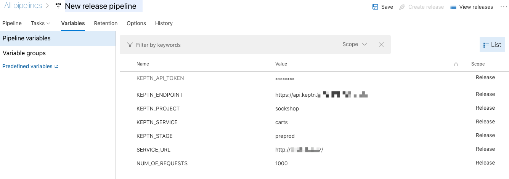

    You will receive the KEPTN_API_TOKEN with the following command: 
    ```
    echo $(kubectl get secret keptn-api-token -n keptn -ojsonpath={.data.keptn-api-token} | base64 --decode)
    ```
    
    Get the KEPTN_ENDPOINT by executing: 
    ```
    echo https://api.keptn.$(kubectl get cm keptn-domain -n keptn -ojsonpath={.data.app_domain})
    ```

    Get the SERVICE_URL by executing:
    ```
    echo http://$(kubectl get svc carts -n preprod -ojsonpath={.status.loadBalancer.ingress[0].ip})/
    ```


## Run the deployment & quality gate
Duration: 4:00

Now that we have everything in place, we can run a test and check the evaluation of the quality gate.

Start the pipeline by clicking on **Create release**. The Azure DevOps pipeline will start to run the tests and then evaluate the quality gate.

Take a look at the logs for the Quality Gate evaluation and you will see the quality gate passed:


Let us now apply a new version of the application from the `manifest/ ` folder.

```
kubectl apply -f carts-v2.yaml
```

After the deployment to the preprod stage we again run the Keptn Quality Gate in our Azure Devops pipeline and watch check the result in the logs:


We can see that the quality gate evaluation has failed! Before we investigate why is has failed, let us run another version and do the evaluation.

```
kubectl apply -f carts-v3.yaml
```

We can investigate all evaluations of the quality gates in the Keptn's bridge - it is the UI with all details of Keptn workflows for all services and stages. We have made the bridge publicly available earlier. Open it in a browser and take a look at all the evaluation details we can see there.


Promote or decline promotion of artifact? Now you can decide based on the score of the Keptn quality gate if you want to promote the artifact to the next stage or if you want to take other actions like rolling back, stopping a canary or whatever actions your deployment strategy offers you.


## Summary
Duration: 1:00

### What we've covered 

1. We created a pipeline with tests and the Keptn quality gate
1. We configured Dynatrace as an SLI provider
    ```
    ---
    spec_version: '1.0'
    indicators:
    throughput: "builtin:service.requestCount.total:merge(0):count?scope=tag(keptn-qualitygates)"
    error_rate: "builtin:service.errors.total.count:merge(0):avg?scope=tag(keptn-qualitygates)"
    response_time_p50: "builtin:service.response.time:merge(0):percentile(50)?scope=tag(keptn-qualitygates)"
    response_time_p90: "builtin:service.response.time:merge(0):percentile(90)?scope=tag(keptn-qualitygates)"
    response_time_p95: "builtin:service.response.time:merge(0):percentile(95)?scope=tag(keptn-qualitygates)"
    ```
1. We created a SLO file with the quality gate definition
    ```
    ---
    spec_version: "0.1.1"
    comparison:
    compare_with: "single_result"
    include_result_with_score: "pass"
    aggregate_function: "avg"
    objectives:
    - sli: "response_time_p95"
        pass:             # pass if (relative change <= 10% AND absolute value is < 600ms)
        - criteria:
            - "<=+15%"  
            - "<600"    
        warning:          # if the response time is below 800ms, the result should be a warning
        - criteria:
            - "<=800"
    - sli: "throughput"   # sli without criteria are used for information only purposes
    - sli: "error_rate"
    - sli: "response_time_p50"
    - sli: "response_time_p90"
    total_score:          # scoring based on all objectives
    pass: "90%"
    warning: "75%"
    ```
1. We deployed and evaluated a version that passed the quality gate
    

1. We deployed and evaluated a version that did not pass the quality gate
    

1. We investigated the evaluations in the Keptn's bridge
    


{{ snippets/community/feedback.md }}
