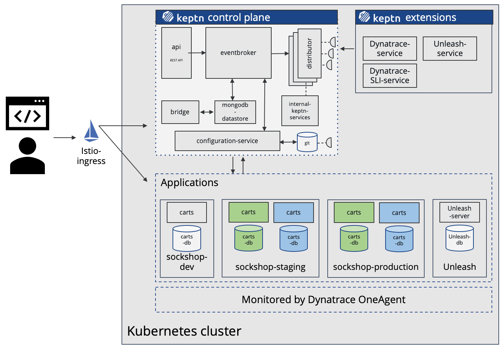

summary: Full Keptn installation on a Kubernetes cluster (GKE recommended)
id: keptn-full-tour-dynatrace-09
categories: Dynatrace,aks,eks,gke,openshift,pks,minikube,full-tour,quality-gates,automated-operations
tags: keptn09x,advanced
status: Published 
authors: Florian Bacher
Feedback Link: https://github.com/keptn/tutorials/tree/master/site/tutorials


# Keptn Full Tour on Dynatrace

## Welcome
Duration: 2:00 


In this tutorial you'll get a full tour through Keptn. Before we get started you'll get to know what you will learn while you walk yourself through this tutorial.

### What you'll learn
- How to create a sample project
- How to onboard a first microservice
- How to deploy your first microservice with blue/green deployments
- How to setup quality gates 
- How to prevent bad builds of your microservice to reach production
- How to trigger the changes of feature toggles in response to issues detected in a production system
<!-- How to integrate other tools like Slack, MS Team, etc in your Keptn integration -->

You'll find a time estimate for completing this tutorial in the right top corner of your screen - this should give you guidance how much time is needed for each step.

In this tutorial, we are going to install Keptn on a Kubernetes cluster, along with Istio for traffic routing and ingress control.

- [Keptn](https://keptn.sh) as a control-plane for continuous delivery and automated operations
- [Istio](https://istio.io) as the ingress and service mesh within the cluster for traffic routing between blue/green versions of our services
- [Unleash](https://unleash.github.io/) as a feature toggle framework that is connected to Keptn to toggle features based on monitoring data


The full setup that we are going to deploy is sketched in the following image.



{{ snippets/09/install/cluster.md }}

{{ snippets/09/install/istio.md }}

{{ snippets/09/install/download-keptnCLI.md }}

{{ snippets/09/install/install-full.md }}

{{ snippets/09/install/configureIstio.md }}

{{ snippets/09/install/authCLI-istio.md }}

{{ snippets/09/monitoring/setupDynatrace.md }}

{{ snippets/09/manage/createProject.md }}

{{ snippets/09/manage/onboardService.md }}

{{ snippets/09/monitoring/configureDynatraceSlis.md }}

{{ snippets/09/quality-gates/setupQualityGate.md }}

{{ snippets/09/self-healing/featureFlagsDynatrace.md }}


## Finish
Duration: 1:00

### Congratulations

Thanks for taking a full tour through Keptn!
Although Keptn has even more to offer that should have given you a good overview what you can do with Keptn.

### What we've covered


- We have created a sample project with the Keptn CLI and set up a multi-stage delivery pipeline with the `shipyard` file.
  ```
apiVersion: "spec.keptn.sh/0.2.0"
kind: "Shipyard"
metadata:
  name: "shipyard-sockshop"
spec:
  stages:
    - name: "dev"
      sequences:
        - name: "delivery"
          tasks:
            - name: "deployment"
              properties:
                deploymentstrategy: "direct"
            - name: "test"
              properties:
                teststrategy: "functional"
            - name: "evaluation"
            - name: "release"
        - name: "delivery-direct"
          tasks:
            - name: "deployment"
              properties:
                deploymentstrategy: "direct"
            - name: "release"

    - name: "staging"
      sequences:
        - name: "delivery"
          triggeredOn:
            - event: "dev.delivery.finished"
          tasks:
            - name: "deployment"
              properties:
                deploymentstrategy: "blue_green_service"
            - name: "test"
              properties:
                teststrategy: "performance"
            - name: "evaluation"
            - name: "release"
        - name: "rollback"
          triggeredOn:
            - event: "staging.delivery.finished"
              selector:
                match:
                  result: "fail"
          tasks:
            - name: "rollback"
        - name: "delivery-direct"
          triggeredOn:
            - event: "dev.delivery-direct.finished"
          tasks:
            - name: "deployment"
              properties:
                deploymentstrategy: "direct"
            - name: "release"

    - name: "production"
      sequences:
        - name: "delivery"
          triggeredOn:
            - event: "staging.delivery.finished"
          tasks:
            - name: "deployment"
              properties:
                deploymentstrategy: "blue_green_service"
            - name: "release"
        - name: "rollback"
          triggeredOn:
            - event: "production.delivery.finished"
              selector:
                match:
                  result: "fail"
          tasks:
            - name: "rollback"
        - name: "delivery-direct"
          triggeredOn:
            - event: "staging.delivery-direct.finished"
          tasks:
            - name: "deployment"
              properties:
                deploymentstrategy: "direct"
            - name: "release"
  ```

- We have set up quality gates based on service level objectives in our `slo` file.
  ```
  ---
  spec_version: "0.1.1"
  comparison:
    aggregate_function: "avg"
    compare_with: "single_result"
    include_result_with_score: "pass"
    number_of_comparison_results: 1
  filter:
  objectives:
    - sli: "response_time_p95"
      key_sli: false
      pass:             # pass if (relative change <= 10% AND absolute value is < 600ms)
        - criteria:
            - "<=+10%"  # relative values require a prefixed sign (plus or minus)
            - "<600"    # absolute values only require a logical operator
      warning:          # if the response time is below 800ms, the result should be a warning
        - criteria:
            - "<=800"
      weight: 1
  total_score:
    pass: "90%"
    warning: "75%"
  ```

- We have tested our quality gates by deploying a bad build to our cluster and verified that Keptn quality gates stopped them.
  

- We have set up self-healing by automated toggling of feature flags in Unleash.
  

{{ snippets/07/integrations/gettingStarted.md }}

{{ snippets/07/community/feedback.md }}
