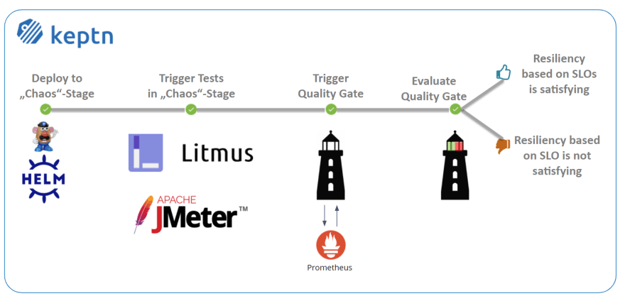
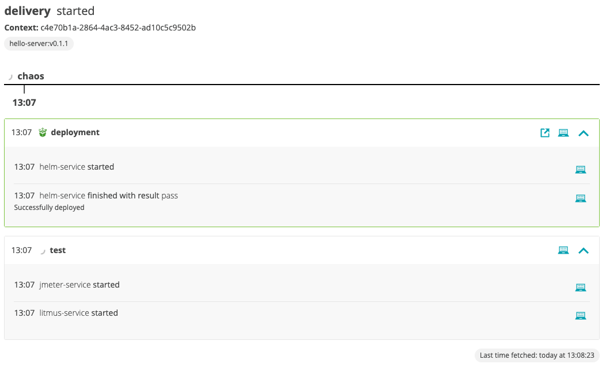
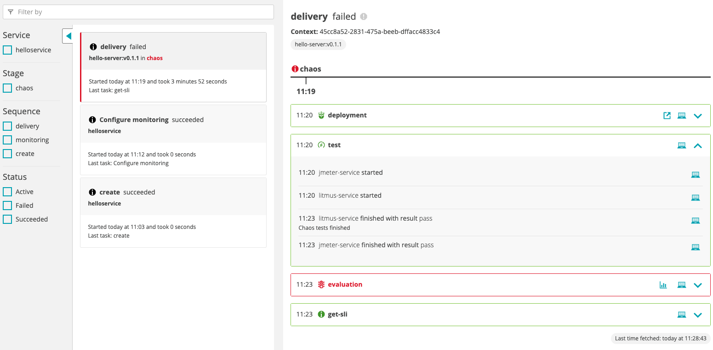
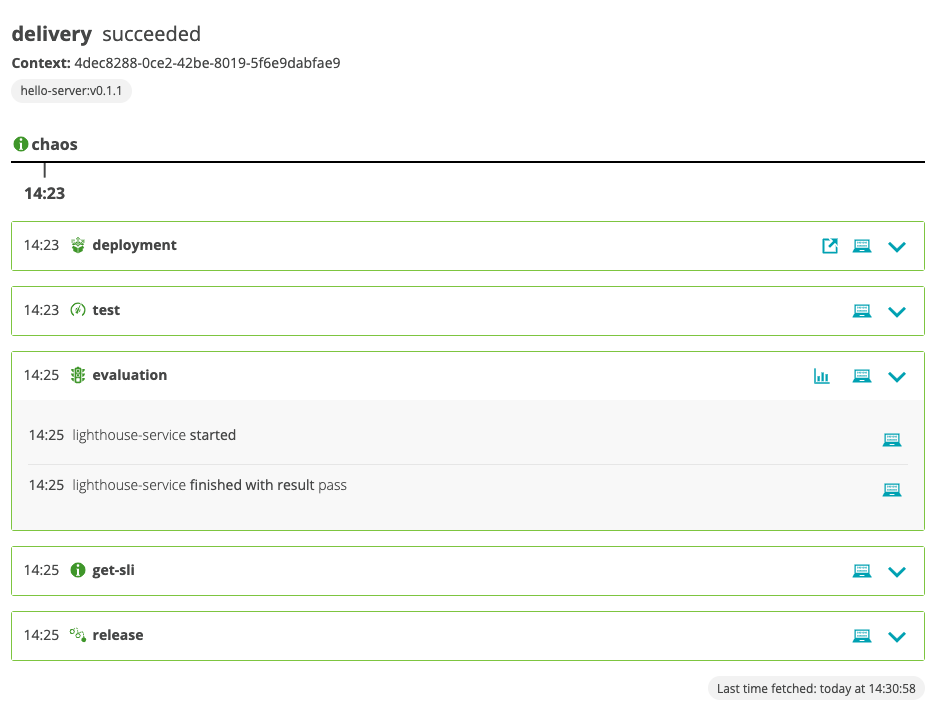
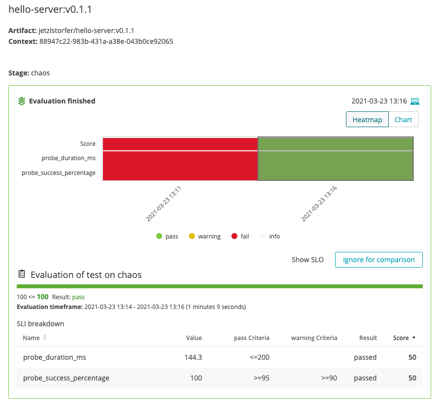

summary: Full Keptn installation on a Kubernetes cluster (GKE recommended)
id: keptn-litmus-013
categories: Prometheus,aks,eks,gke,openshift,pks,minikube,quality-gates,litmus
tags: keptn013x,advanced
status: Published 
authors: Jürgen Etzlstorfer
Feedback Link: https://github.com/keptn/tutorials/tree/master/site/tutorials


# Resilience evaluation with LitmusChaos, Prometheus, and Keptn

## Welcome
Duration: 2:00 

In this tutorial, we'll set up a demo application and have it undergo some chaos in combination with load testing. We will then use Keptn quality gates to evaluate the resilience of the application based on SLO-driven quality gates.


### What we will cover
- How to create a sample project and create a sample service
- How to setup quality gates 
- How to add the Litmus integration and execute chaos
- How to evaluate application resilience

You'll find a time estimate until the end of this tutorial in the right top corner of your screen - this should give you guidance how much time is needed for each step.


In this tutorial, we are going to install Keptn on a Kubernetes cluster.

The full setup that we are going to deploy is sketched in the following image.


If you are interested, please have a look at this presentation from Litmus and Keptn maintainers presenting the initial integration.


{{ snippets/13/install/cluster.md }}

{{ snippets/13/install/istio.md }}

{{ snippets/13/install/download-keptnCLI.md }}

{{ snippets/13/install/install-full.md }}

{{ snippets/13/install/configureIstio.md }}

{{ snippets/13/install/authCLI-istio.md }}

## Download demo resources
Duration: 1:00

Demo resources are prepared for you on Github for a convenient experience. We are going to download them to a local machine so we have them handy.

```
git clone --branch=release-0.2.0 https://github.com/keptn-sandbox/litmus-service.git --single-branch
```

Now, let's switch to the directory including the demo resources.

```
cd litmus-service/test-data
```


## Install Litmus Operator & Chaos CRDs
Duration: 3:00

1. Let us install LitmusChaos into our Kubernetes cluster. This can be done via `kubectl`.

    ```
    kubectl apply -f ./litmus/litmus-operator-v1.13.2.yaml 
    ```

1. We are going to create a namespace where we are later executing our chaos experiments.

    ```
    kubectl create namespace litmus-chaos
    ```

1. We also need to create the custom resources for the experiments we want to run later, as well as some permissions.

    ```
    kubectl apply -f ./litmus/pod-delete-ChaosExperiment-CR.yaml 

    kubectl apply -f ./litmus/pod-delete-rbac.yaml 
    ```

## Setup Prometheus
Duration: 3:00

Before we are going to create the project with Keptn, we'll install the Prometheus integration to be ready to fetch the data that is later on needed for the SLO-based quality gate evaluation. 

Keptn doesn't install or manage Prometheus and its components. Users need to install Prometheus and Prometheus Alert manager as a prerequisite. 

* To install the Prometheus and Alert Manager, execute:
<!-- command -->
```
kubectl create ns monitoring
helm repo add prometheus-community https://prometheus-community.github.io/helm-charts
helm install prometheus prometheus-community/prometheus --namespace monitoring
```

### Execute the following steps to install prometheus-service

* Download the Keptn's Prometheus service manifest
<!-- command -->
```
kubectl apply -f  https://raw.githubusercontent.com/keptn-contrib/prometheus-service/release-0.6.0/deploy/service.yaml
```

* Replace the environment variable value according to the use case and apply the manifest
<!-- command -->
```
# Prometheus installed namespace
kubectl set env deployment/prometheus-service -n keptn --containers="prometheus-service" PROMETHEUS_NS="monitoring"

# Setup Prometheus Endpoint
kubectl set env deployment/prometheus-service -n keptn --containers="prometheus-service" PROMETHEUS_ENDPOINT="http://prometheus-server.monitoring.svc.cluster.local:80"

# Alert Manager installed namespace
kubectl set env deployment/prometheus-service -n keptn --containers="prometheus-service" ALERT_MANAGER_NS="monitoring"
```

* Install Role and Rolebinding to permit Keptn's prometheus-service for performing operations in the Prometheus installed namespace.
<!-- command -->
```
kubectl apply -f https://raw.githubusercontent.com/keptn-contrib/prometheus-service/release-0.6.0/deploy/role.yaml -n monitoring
```

<!-- 
bash wait_for_deployment_in_namespace "prometheus-service" "keptn" 
bash wait_for_deployment_in_namespace "prometheus-service-monitoring-configure-distributor" "keptn" 
sleep 10
-->

### Optional: Verify Prometheus setup in your cluster

* To verify that the Prometheus scrape jobs are correctly set up, you can access Prometheus by enabling port-forwarding for the prometheus-service:
<!-- command -->
```
kubectl port-forward svc/prometheus-server 8080:80 -n monitoring
```


## Setup Litmus integration
Duration: 1:00

Similar to the Prometheus integration, we are now adding the Litmus integration. This integration will be responsible to trigger the experiments with Litmus and listens for `sh.keptn.event.test.triggered` events that are sent from Keptn.

This can be done via the following command.

```
kubectl apply -f ../deploy/service.yaml
```

We now have all the integrations installed and connected to the Keptn control plane. Let's move on with setup up a project!

## Create project
Duration: 1:00

A project in Keptn is the logical unit that can hold multiple (micro)services. Therefore, it is the starting point for each Keptn installation.
We have already cloned the demo resources from Github, so we can go ahead and create the project.


**Recommended:** Create a new project with Git upstream:

To configure a Git upstream for this tutorial, the Git user (`--git-user`), an access token (`--git-token`), and the remote URL (`--git-remote-url`) are required. If a requirement is not met, go to [the Keptn documentation](https://keptn.sh/docs/0.9.0/manage/git_upstream/) where instructions for GitHub, GitLab, and Bitbucket are provided.

Let's define the variables before running the command:

<!-- bash keptn create project litmus --shipyard=./shipyard.yaml -->

```
GIT_USER=gitusername
GIT_TOKEN=gittoken
GIT_REMOTE_URL=remoteurl
```

Now let's create the project using the `keptn create project` command.

```
keptn create project litmus --shipyard=./shipyard.yaml --git-user=$GIT_USER --git-token=$GIT_TOKEN --git-remote-url=$GIT_REMOTE_URL
```


**Alternatively:** If you don't want to use a Git upstream, you can create a new project without it but please note that this is not the recommended way:

<!-- command -->
```
keptn create project litmus --shipyard=./shipyard.yaml
```


For creating the project, the tutorial relies on a `shipyard.yaml` file as shown below:

```
apiVersion: "spec.keptn.sh/0.2.0"
kind: "Shipyard"
metadata:
  name: "shipyard-litmus-chaos"
spec:
  stages:
    - name: "chaos"
      sequences:
        - name: "delivery"
          tasks:
            - name: "deployment"
              properties:
                deploymentstrategy: "direct"
            - name: "test"
              properties:
                teststrategy: "performance"
            - name: "evaluation"
```

In the `shipyard.yaml` shown above, we define a single stage called *chaos* with a single sequence called *delivery*. In this sequence, a *deployment*, *test*, and *evaluation*  task is defined (along with some properties). With this, Keptn sets up the environment and makes sure, that tests are triggered after each deployment, and the tests are then evaluated by Keptn quality gates. As we do not have a subsequent stage, we do not need an *approval* or *release* task.

## Create a service
Duration: 2:00

After creating the project, services can be created for our project.
For this purpose we need the helm charts as a tar.gz archive. To archive it use following command:

<!-- command -->
```
tar cfvz ./helloservice/helm.tgz ./helloservice/helm
```

1. Create the **helloservice** service using the [keptn create service](https://keptn.sh/docs/0.10.x/reference/cli/commands/keptn_create_service/) and [keptn add-resource](https://keptn.sh/docs/0.10.x/reference/cli/commands/keptn_add-resource/)commands:

    <!-- command -->
    ```
    keptn create service helloservice --project=litmus
    keptn add-resource --project=litmus --service=helloservice --all-stages --resource=./helloservice/helm.tgz --resourceUri=helm/helloservice.tgz
    ```

1. After creating the service, tests need to be added as basis for quality gates. We are using JMeter tests, as the JMeter service comes "batteries included" with our Keptn installation. Although this could be changed to other testing tools, we are going with JMeter in this tutorial. Let's add some JMeter tests as well as a configuration file to Keptn.

    <!-- command -->
    ```
    keptn add-resource --project=litmus --stage=chaos --service=helloservice --resource=./jmeter/load.jmx --resourceUri=jmeter/load.jmx
    keptn add-resource --project=litmus --stage=chaos --service=helloservice --resource=./jmeter/jmeter.conf.yaml --resourceUri=jmeter/jmeter.conf.yaml
    ```

Now each time Keptn triggers the test execution, the JMeter service will pick up both files and execute the tests.

## Configure Quality Gate
Duration: 2:00

We have not yet added our quality gate, i.e., the evaluation of several SLOs done by Keptn. Let's do this now!


1. First, we are going to add an SLI file that holds all service-level indicators we want to evaluate along with their PromQL expressions. Learn more about the concept of [Service-Level Indicators in the Keptn docs](https://keptn.sh/docs/concepts/quality_gates/#what-is-a-service-level-indicator-sli).

    ```
    keptn add-resource --project=litmus --stage=chaos --service=helloservice --resource=./prometheus/sli.yaml --resourceUri=prometheus/sli.yaml
    ```

1. Now that we have added our SLIs, let us add the quality gate in terms of an `slo.yaml` which adds objectives for our metrics that have to be satisfied. earn more about the concept of [Service-Level Objectives in the Keptn docs](https://keptn.sh/docs/concepts/quality_gates/#what-is-a-service-level-objective-slo).

    ```
    keptn add-resource --project=litmus --stage=chaos --service=helloservice --resource=helloservice/slo.yaml --resourceUri=slo.yaml
    ```

We've now added our quality gate, let's move on to add the chaos instructions and then run our experiment!

## Adding Litmus Chaos Experiment to Keptn
Duration: 1:00

We have already installed LitmusChaos on our Kubernetes cluster, but we have not yet added or executed a chaos experiment. Let's do this now!

Let us add the `experiment.yaml` file that holds the chaos experiment instructions. It will be picked up by the LitmusChaos integration of Keptn each time a test is triggered. Therefore, Keptn makes sure that both, JMeter tests as well as LitmusChaos tests, are executed during the `test` task sequence.

```
keptn add-resource --project=litmus --stage=chaos --service=helloservice --resource=./litmus/experiment.yaml --resourceUri=litmus/experiment.yaml
```

Great job - the file is added and we can move on!

## Configure Prometheus
Duration: 2:00

Before we are going to run the experiment, we have to make sure that we have some observability software in place that will actually monitor how the service is behaving under the testing conditions. 

1. Let's use the Keptn CLI to configure Prometheus. It will set up a Prometheus deployment and configures it to be ready for Keptn usage. 

    ```
    keptn configure monitoring prometheus --project=litmus --service=helloservice
    ```

1. Next, we are going to add a `blackbox-exporter` for Prometheus that is able to observe our service under test from the outside, i.e., as a blackbox. 

    ```
    kubectl apply -f ./prometheus/blackbox-exporter.yaml
    kubectl apply -f ./prometheus/prometheus-server-conf-cm.yaml -n monitoring
    ```

1. Finally, restart Prometheus to pick up the new configuration
    
    ```
    kubectl delete pod -l app=prometheus-server -n monitoring
    ```

Now everything is in place, let's run our experiments and evaluate the resilience of our demo application!

## Run experiment
Duration: 4:00

We are now ready to kick off a new deployment of our test application with Keptn and have it deployed, tested, and evaluated.

1. Let us now trigger the deployment, tests, and evaluation of our demo application.

    ```
    keptn trigger delivery --project=litmus --service=helloservice --image=jetzlstorfer/hello-server:v0.1.1
    ```

1. Let's have a look in the Keptn bridge what is actually going on. We can use this helper command to retrieve the URL of our Keptn bridge.

    ```
    echo http://$(kubectl -n keptn get ingress api-keptn-ingress -ojsonpath='{.spec.rules[0].host}')/bridge
    ```

    The credentials can be retrieved via the following commands:

    <!-- command -->
    ```
    echo Username: $(kubectl get secret -n keptn bridge-credentials -o jsonpath="{.data.BASIC_AUTH_USERNAME}" | base64 --decode)
    echo Password: $(kubectl get secret -n keptn bridge-credentials -o jsonpath="{.data.BASIC_AUTH_PASSWORD}" | base64 --decode)
    ```

    

1. We can see that the evaluation failed, but why is that?

    

1. Let's take a look at the evaluation - lick on the *chart* icon in the red evaluation tile.

    

    We can see that the evaluation failed because both the `probe_duration_ms` as well as the `probe_success_percentage` SLOs did not meet their criteria.
    Considering the fact that our chaos experiment did delete the pod of our application, we might want to increase the number of replicas that are running to make our application more resilient. Let's do this in the next step.


## Increase resilience
Duration: 3:00

1. Let's do another run of our deployment, tests, and evaluation. But this time, we are increasing the `replicaCount` meaning that we run 3 instances of our application. If one of those get deleted by Litmus, the two others should still be able to serve the traffic.
This time we are using the `keptn send event` command with an event payload that has been already prepared for the demo (i.e., the `replicaCount` is set to 3).

    ```
    keptn send event -f helloservice/deploy-event.json
    ```

1. Let's have a look at the second run. We can see that this time the evaluation was successful.

    

1. Taking a look at the detailed evaluation results we can see that all probes were successful and did finish within the objectives we have set.

    

1. If you want, you can now experiment with different SLOs or different `replicaCount` to evaluate the resilience of your application in terms of being responsive when the pod of this application gets deleted. Keptn will make sure that JMeter tests and chaos tests are executed each time you run the experiment.

## Finish
Duration: 1:00

Congratulations! You have successfully completed this tutorial and evaluated the resilience of a demo microservice application with LitmusChaos and Keptn. 

### What we've covered in this tutorial

- We've created a project based on a `shipyard` definition.
    ```
    apiVersion: "spec.keptn.sh/0.2.0"
    kind: "Shipyard"
    metadata:
      name: "shipyard-litmus-chaos"
    spec:
      stages:
        - name: "chaos"
          sequences:
            - name: "delivery"
              tasks:
                - name: "deployment"
                  properties:
                    deploymentstrategy: "direct"
                - name: "test"
                  properties:
                    teststrategy: "performance"
                - name: "evaluation"
    ```

- We've added the Litmus integration and did a successful run of a sequence with JMeter + LitmusChaos

    

- We've executed chaos tests and evaluated their impact on our application

    

- We've increased resilience by adding more instances of our demo application to the game
    


{{ snippets/13/community/feedback.md }}
