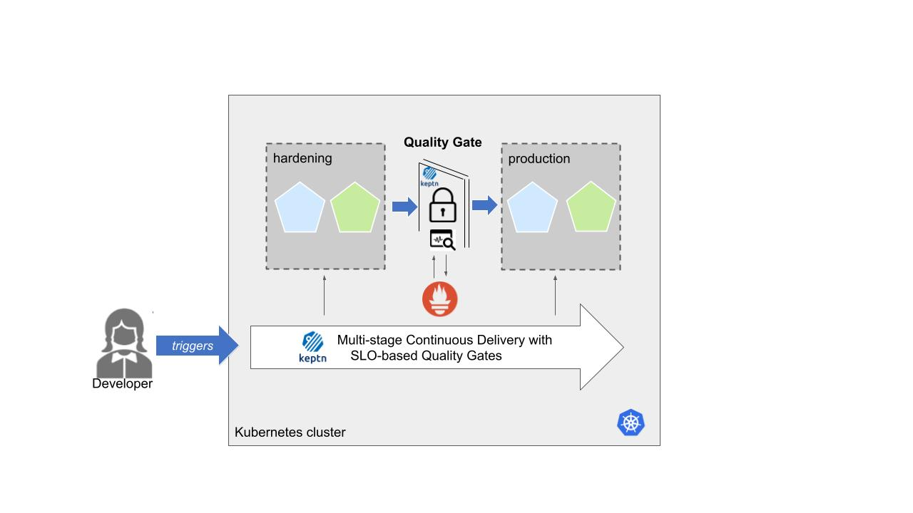
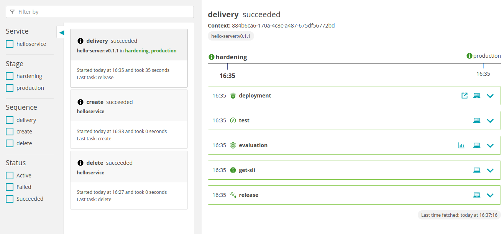
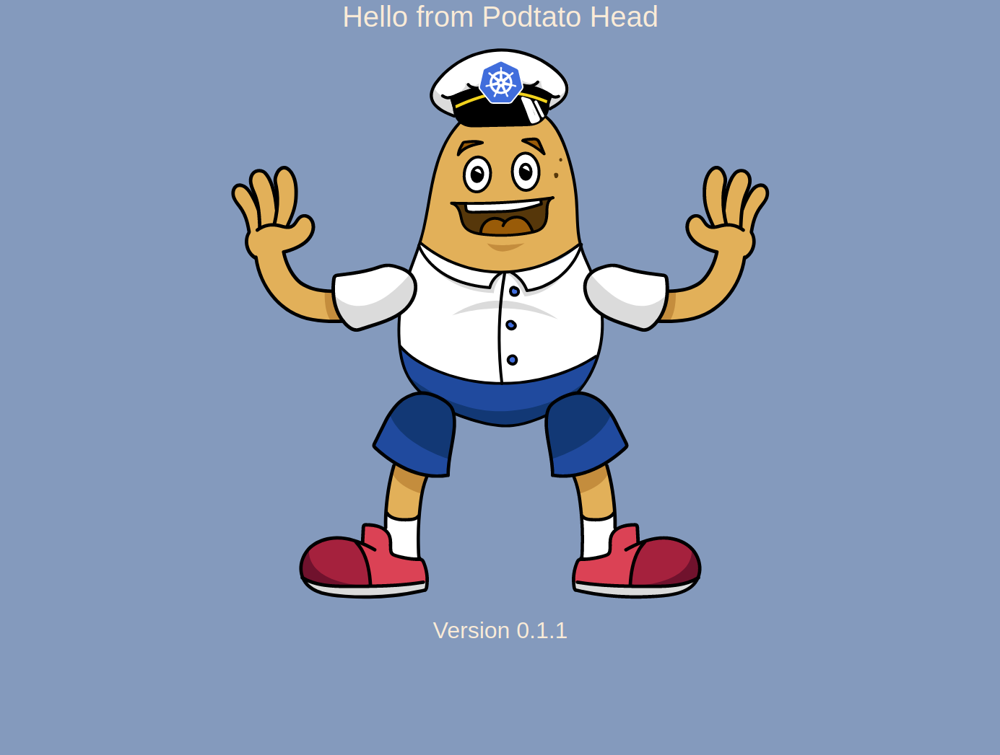
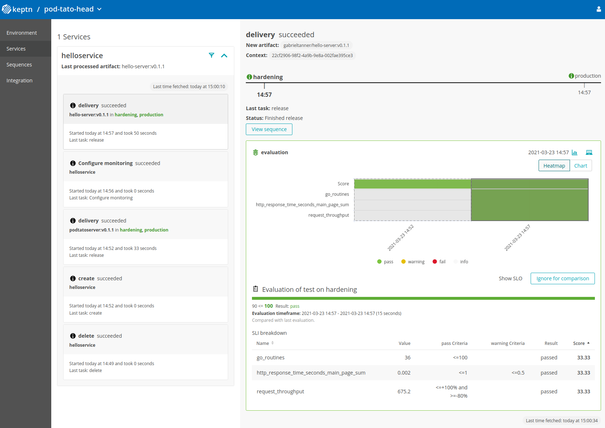

summary: Full Keptn installation on a Kubernetes cluster (GKE recommended)
id: keptn-multistage-qualitygates-010
categories: Prometheus,aks,eks,gke,openshift,minikube,full-tour,quality-gates
tags: keptn010x,advanced
status: Published
authors: Gabriel Tanner
Feedback Link: https://github.com/keptn/tutorials/tree/master/site/tutorials

# Multi-stage delivery with Quality Gates using Prometheus and Podtato-head application

## Welcome
Duration: 2:00

In this tutorial we'll set up the Podtato-head demo application which will feature different Prometheus metrics and deploy the application using multistage delivery. We will then use Keptn quality gates to evaluate the quality of the application based on SLO-driven quality gates.

### What we will cover

- How to create a sample project and create a sample service
- How to setup quality gates
- How to use Prometheus metrics in our SLIs & SLOs
- How to prevent bad builds of your microservice to reach production

In this tutorial, we are going to install Keptn on a Kubernetes cluster.

The full setup that we are going to deploy is sketched in the following image.



If you are interested, please have a look at this article that explains the deployment in more detail.

[Modern continuous delivery on Kubernetes for Developers - dev.to](https://dev.to/gabrieltanner/modern-continuous-delivery-on-kubernetes-for-developers-5chf)

{{ snippets/010/install/cluster.md }}

{{ snippets/010/install/istio.md }}

{{ snippets/010/install/download-keptnCLI.md }}

{{ snippets/010/install/install-full.md }}

{{ snippets/010/install/configureIstio.md }}

{{ snippets/010/install/authCLI-istio.md }}

## Download the demo resources
Duration: 1:00

The demo resources can be found on Github for a convenient experience. Let's clone the project's repository, so we have all the resources needed to get started.

<!-- command -->
```
git clone https://github.com/cncf/podtato-head.git
```

Now, let's switch to the directory including the demo resources.

<!-- command -->
```
cd podtato-head/delivery/keptn
```

## Create project
Duration: 1:00

A project in Keptn is the logical unit that can hold multiple (micro)services. Therefore, it is the starting point for each Keptn installation.
We have already cloned the demo resources from Github, so we can go ahead and create the project.

**Recommended:** Create a new project with Git upstream:

To configure a Git upstream for this tutorial, the Git user (`--git-user`), an access token (`--git-token`), and the remote URL (`--git-remote-url`) are required. If a requirement is not met, go to [the Keptn documentation](https://keptn.sh/docs/0.9.0/manage/git_upstream/) where instructions for GitHub, GitLab, and Bitbucket are provided.

Let's define the variables before running the command:

```
GIT_USER=gitusername
GIT_TOKEN=gittoken
GIT_REMOTE_URL=remoteurl
```

Now let's create the project using the `keptn create project` command.

```
keptn create project pod-tato-head --shipyard=./shipyard.yaml --git-user=$GIT_USER --git-token=$GIT_TOKEN --git-remote-url=$GIT_REMOTE_URL
```

**Alternatively:** If you don't want to use a Git upstream, you can create a new project without it but please note that this is not the recommended way:

<!-- command -->
```
keptn create project pod-tato-head --shipyard=./shipyard.yaml
```

For creating the project, the tutorial relies on a `shipyard.yaml` file as shown below:

```
apiVersion: "spec.keptn.sh/0.2.0"
kind: "Shipyard"
metadata:
  name: "shipyard-sockshop"
spec:
  stages:
    - name: "hardening"
      sequences:
        - name: "delivery"
          tasks:
            - name: "deployment"
              properties:
                deploymentstrategy: "blue_green_service"
            - name: "test"
              properties:
                teststrategy: "performance"
            - name: "evaluation"
            - name: "release"
    - name: "production"
      sequences:
        - name: "delivery"
          triggeredOn:
            - event: "hardening.delivery.finished"
          tasks:
            - name: "deployment"
              properties:
                deploymentstrategy: "blue_green_service"
            - name: "release"
```

In the `shipyard.yaml` shown above, we define two stages called *hardening* and *production* with a single sequence called *delivery*. The *hardening* stage defines a *delivery* sequence with a deployment, test, evaluation and release task (along with some other properties) while the *production* stage only includes a deployment and release task. The *production* stage also features a *triggeredOn* properties which defines when the stage will be executed (in this case after the hardening stage has finished the delivery sequence). With this, Keptn sets up the environment and makes sure, that tests are triggered after each deployment, and the tests are then evaluated by Keptn quality gates. Keptn performs a blue/green deployment (i.e., two deployments simultaneously with routing of traffic to only one deployment) and triggers a performance test in the hardening stage. Once the tests complete successfully, the deployment moves into the production stage using another blue/green deployment.

## Create a service
Duration: 2:00

After creating the project, we can continue by onboarding the *helloserver* as a service to your project using the `keptn create service` and `keptn add-resource` commands. You need to pass the project where you want to create the service, as well as the Helm chart of the service.
For this purpose we need the helm charts as a tar.gz archive. To archive it use following command:

<!-- command -->
```
tar cfvz ./helm-charts/helloserver.tgz ./helm-charts/helloserver
```

Then the service can be created:
<!-- command -->
```
keptn create service helloserver --project="pod-tato-head"
keptn add-resource --project="pod-tato-head" --service=helloserver --all-stages --resource=./helm-charts/helloserver.tgz --resourceUri=helm/helloserver.tgz
```

After onboarding the service, tests (i.e., functional- and performance tests) need to be added as basis for quality gates. We are using JMeter tests, as the JMeter service comes "batteries included" with our Keptn installation.

<!-- command -->
```
keptn add-resource --project=pod-tato-head --stage=hardening --service=helloservice --resource=jmeter/load.jmx --resourceUri=jmeter/load.jmx
keptn add-resource --project=pod-tato-head --stage=hardening --service=helloservice --resource=jmeter/jmeter.conf.yaml --resourceUri=jmeter/jmeter.conf.yaml
```

Now each time Keptn triggers the test execution, the JMeter service will pick up both files and execute the tests.

## Deploy first build with Keptn
Duration: 4:00

We are now ready to kick off a new deployment of our test application with Keptn and have it deployed, tested, and evaluated.

1. Let us now trigger the deployment, tests, and evaluation of our demo application.

    <!-- command -->
    ```
    keptn trigger delivery --project="pod-tato-head" --service=helloservice --image="gabrieltanner/hello-server" --tag=v0.1.1
    ```

    <!-- bash
    verify_test_step $? "trigger delivery for helloservice failed"
    wait_for_deployment_with_image_in_namespace "helloservice" "pod-tato-head-production" "gabrieltanner/hello-server:v0.1.1"
    verify_test_step $? "Deployment helloservice not available, exiting..."
    -->

1. Let's have a look in the Keptn bridge what is actually going on. We can use this helper command to retrieve the URL of our Keptn bridge.

    <!-- command -->
    ```
    echo http://$(kubectl -n keptn get ingress api-keptn-ingress -ojsonpath='{.spec.rules[0].host}')/bridge
    ```

    The credentials can be retrieved via the following commands:

    <!-- command -->
    ```
    echo Username: $(kubectl get secret -n keptn bridge-credentials -o jsonpath="{.data.BASIC_AUTH_USERNAME}" | base64 --decode)
    echo Password: $(kubectl get secret -n keptn bridge-credentials -o jsonpath="{.data.BASIC_AUTH_PASSWORD}" | base64 --decode)
    ```

    

1. **Optional:** Verify the pods that should have been created for the helloservice

    <!-- debug -->
    ```
    kubectl get pods --all-namespaces | grep helloservice
    ```

    ```
    pod-tato-head-hardening    helloservice-primary-5f779966f9-vjjh4                        2/2     Running   0          4m55s
    pod-tato-head-production   helloservice-primary-5f779966f9-kbhz5                        2/2     Running   0          2m52s
    ```

## View helloservice

You can get the URL for the helloservice with the following commands in the respective namespaces:

Hardening:

<!-- command -->
```
echo http://helloservice.pod-tato-head-hardening.$(kubectl -n keptn get ingress api-keptn-ingress -ojsonpath='{.spec.rules[0].host}')
```

Production:

<!-- command -->
```
echo http://helloservice.pod-tato-head-production.$(kubectl -n keptn get ingress api-keptn-ingress -ojsonpath='{.spec.rules[0].host}')
```

Navigating to the URLs should result in the following output:



## Setup Prometheus Monitoring
Duration: 3:00

After creating a project and service, you can set up Prometheus monitoring and configure scrape jobs using the Keptn CLI. 

Keptn doesn't install or manage Prometheus and its components. Users need to install Prometheus and Prometheus Alert manager as a prerequisite. 

* To install the Prometheus and Alert Manager, execute:
<!-- command -->
```
kubectl create ns monitoring
helm repo add prometheus-community https://prometheus-community.github.io/helm-charts
helm install prometheus prometheus-community/prometheus --namespace monitoring
```

### Execute the following steps to install prometheus-service

* Download the Keptn's Prometheus service manifest
<!-- command -->
```
kubectl apply -f https://raw.githubusercontent.com/keptn-contrib/prometheus-service/release-0.7.1/deploy/service.yaml
```

* Replace the environment variable value according to the use case and apply the manifest
<!-- command -->
```
# Prometheus installed namespace
kubectl set env deployment/prometheus-service -n keptn --containers="prometheus-service" PROMETHEUS_NS="monitoring"

# Setup Prometheus Endpoint
kubectl set env deployment/prometheus-service -n keptn --containers="prometheus-service" PROMETHEUS_ENDPOINT="http://prometheus-server.monitoring.svc.cluster.local:80"

# Alert Manager installed namespace
kubectl set env deployment/prometheus-service -n keptn --containers="prometheus-service" ALERT_MANAGER_NS="monitoring"
```

* Install Role and Rolebinding to permit Keptn's prometheus-service for performing operations in the Prometheus installed namespace.
<!-- command -->
```
kubectl apply -f https://raw.githubusercontent.com/keptn-contrib/prometheus-service/release-0.7.1/deploy/role.yaml -n monitoring
```

<!-- 
bash wait_for_deployment_in_namespace "prometheus-service" "keptn" 
bash wait_for_deployment_in_namespace "prometheus-service-monitoring-configure-distributor" "keptn" 
sleep 10
-->
    

* Execute the following command to install Prometheus and set up the rules for the *Prometheus Alerting Manager*:
<!-- command -->
```
keptn configure monitoring prometheus --project=pod-tato-head --service=helloservice
```

<!-- bash wait_for_deployment_in_namespace "alertmanager" "monitoring" -->
<!-- bash wait_for_deployment_in_namespace "prometheus-deployment" "monitoring" -->

### Optional: Verify Prometheus setup in your cluster

* To verify that the Prometheus scrape jobs are correctly set up, you can access Prometheus by enabling port-forwarding for the prometheus-service:
<!-- command -->
```
kubectl port-forward svc/prometheus-server 8080:80 -n monitoring
```

Prometheus is then available on [localhost:8080/targets](http://localhost:8080/targets) where you can see the targets for the service:


### Setup Prometheus SLI provider

During the evaluation of a quality gate, the Prometheus provider is required that is implemented by an internal Keptn service, the *prometheus-service*. This service will _fetch the values_ for the SLIs that are referenced in an SLO configuration file.

We are going to add the configuration for our SLIs in terms of an SLI file that maps the _name_ of an indicator to a PromQL statement how to actually query it.

<!-- command -->
```
keptn add-resource --project=pod-tato-head --stage=hardening --service=helloservice --resource=prometheus/sli.yaml --resourceUri=prometheus/sli.yaml
```

For your information, the contents of the file are as follows:

```
---
spec_version: '1.0'
indicators:
  http_response_time_seconds_main_page_sum: sum(rate(http_server_request_duration_seconds_sum{method="GET",route="/",status_code="200",job="$SERVICE-$PROJECT-$STAGE-canary"}[$DURATION_SECONDS])/rate(http_server_request_duration_seconds_count{method="GET",route="/",status_code="200",job="$SERVICE-$PROJECT-$STAGE-canary"}[$DURATION_SECONDS]))
  http_requests_total_sucess: http_requests_total{status="success"}
  go_routines: go_goroutines{job="$SERVICE-$PROJECT-$STAGE"}
  request_throughput: sum(rate(http_requests_total{status="success"}[$DURATION_SECONDS]))
```

## Set up the quality gate
Duration: 4:00

Keptn requires a performance specification for the quality gate. This specification is described in a file called `slo.yaml`, which specifies a Service Level Objective (SLO) that should be met by a service. To learn more about the *slo.yaml* file, go to [Specifications for Site Reliability Engineering with Keptn](https://github.com/keptn/spec/blob/master/service_level_objective.md).

Activate the quality gates for the helloservice. Therefore, navigate to the `delivery/keptn` folder and upload the `slo.yaml` file using the [add-resource](https://keptn.sh/docs/0.10.x/reference/cli/commands/keptn_add-resource/) command:

<!-- command -->

```
keptn add-resource --project=pod-tato-head --stage=hardening --service=helloservice --resource=slo.yaml --resourceUri=slo.yaml
```

This will add the `slo.yaml` file to your Keptn - which is the declarative definition of a quality gate. Let's take a look at the file contents:

```
---
spec_version: '0.1.0'
comparison:
  compare_with: "single_result"
  include_result_with_score: "pass"
  aggregate_function: avg
objectives:
  - sli: http_response_time_seconds_main_page_sum
    pass:
      - criteria:
          - "<=1"
    warning:
      - criteria:
          - "<=0.5"
  - sli: request_throughput
    pass:
      - criteria:
          - "<=+100%"
          - ">=-80%"
  - sli: go_routines
    pass:
      - criteria:
          - "<=100"
total_score:
  pass: "90%"
  warning: "75%"
```

## Deploying artifact with quality gates
Duration: 3:00

You can now deploy another artifact and see the quality gates in action.

<!-- command -->
```
keptn trigger delivery --project="pod-tato-head" --service=helloservice --image="gabrieltanner/hello-server" --tag=v0.1.1
```

<!-- bash 
verify_test_step $? "trigger delivery for helloservice failed"
wait_for_deployment_with_image_in_namespace "helloservice" "pod-tato-head-production" "gabrieltanner/hello-server:v0.1.1"
verify_test_step $? "Deployment helloservice not available, exiting..."
-->

After sending the artifact you can see the test results in Keptn Bridge.



## Deploy a slow build version
Duration: 5:00

1. Use the Keptn CLI to deploy a version of the *helloservice*, which contains an artificial **slowdown of 2 second** in each request.

    <!-- command -->
    ```
    keptn trigger delivery --project="pod-tato-head" --service=helloservice --image="gabrieltanner/hello-server" --tag=v0.1.2
    ```

    <!-- bash 
    verify_test_step $? "trigger delivery for helloservice failed"
    wait_for_deployment_with_image_in_namespace "helloservice" "pod-tato-head-hardening" "gabrieltanner/hello-server:v0.1.2"
    verify_test_step $? "Deployment helloservice not available, exiting..."
    echo "Waiting for a little bit!"
    wait_for_event_with_field_output "sh.keptn.event.release.finished" ".data.result" "fail" "pod-tato-head"
    sleep 60
    -->

1. Go ahead and verify that the slow build has reached your `hardening` environment by opening a browser. You can get the URL with this command:

    <!-- command -->
    ```
    echo http://helloservice.pod-tato-head-hardening.$(kubectl -n keptn get ingress api-keptn-ingress -ojsonpath='{.spec.rules[0].host}')
    ```

## Quality gate in action
Duration: 7:00

After triggering the deployment of the *helloservice* in version v0.1.2, the following behaviour is expected:

* **Hardening stage:** In this stage, version v0.1.2 will be deployed and the performance test starts to run for about 10 minutes. After the test is completed, Keptn triggers the test evaluation and identifies the slowdown. Consequently, a roll-back to version v0.1.1 in this stage is conducted and the promotion to production is not triggered.


* **Production stage:** The slow version is **not promoted** to the production stage because of the active quality gate in place. Thus, still version v0.1.1 is expected to be in production.
  - To verify, navigate to:
  <!-- command -->
  ```
  echo http://helloservice.pod-tato-head-production.$(kubectl -n keptn get ingress api-keptn-ingress -ojsonpath='{.spec.rules[0].host}')
  ```

## Verify the quality gate in Keptn's Bridge
Duration: 3:00

Take a look in the Keptn's bridge and navigate to the last deployment. You will find a quality gate evaluation that got a `fail` result when evaluation the SLOs of our *helloservice* microservice. Thanks to this quality gate the slow build won't be promoted to production but instead automatically rolled back.

To verify, the [Keptn's Bridge](https://keptn.sh/docs/0.10.x/reference/bridge/) shows the deployment of v0.1.2 and then the failed test in hardening including the roll-back.


Here you can see that some of your defined test cases (for example, the response time) failed because you deployed a slow build that is not suitable for production. Once the test fails, the deployment will not be promoted to production and the hardening stage will return to its original state.

## Finish
Duration: 1:00

Thanks for taking a full tour through Keptn!
Although Keptn has even more to offer that should have given you a good overview what you can do with Keptn.

### What we've covered

- We have created a sample project with the Keptn CLI and set up a multi-stage delivery pipeline with the `shipyard` file

    ```
    apiVersion: "spec.keptn.sh/0.2.0"
    kind: "Shipyard"
    metadata:
    name: "shipyard-sockshop"
    spec:
    stages:
        - name: "hardening"
        sequences:
            - name: "delivery"
            tasks:
                - name: "deployment"
                properties:
                    deploymentstrategy: "blue_green_service"
                - name: "test"
                properties:
                    teststrategy: "performance"
                - name: "evaluation"
                - name: "release"
        - name: "production"
        sequences:
            - name: "delivery"
            triggeredOn:
                - event: "hardening.delivery.finished"
            tasks:
                - name: "deployment"
                properties:
                    deploymentstrategy: "blue_green_service"
                - name: "release"
    ```

- We have set up quality gates based on service level objectives in our `slo` file
    ```
    ---
    spec_version: '0.1.0'
    comparison:
    compare_with: "single_result"
    include_result_with_score: "pass"
    aggregate_function: avg
    objectives:
    - sli: http_response_time_seconds_main_page_sum
        pass:
        - criteria:
            - "<=1"
        warning:
        - criteria:
            - "<=0.5"
    - sli: request_throughput
        pass:
        - criteria:
            - "<=+100%"
            - ">=-80%"
    - sli: go_routines
        pass:
        - criteria:
            - "<=100"
    total_score:
    pass: "90%"
    warning: "75%"
    ```


- We have tested our quality gates by deploying a bad build to our cluster and verified that Keptn quality gates stopped them.
  


{{ snippets/010/integrations/gettingStarted.md }}

{{ snippets/010/community/feedback.md }}
