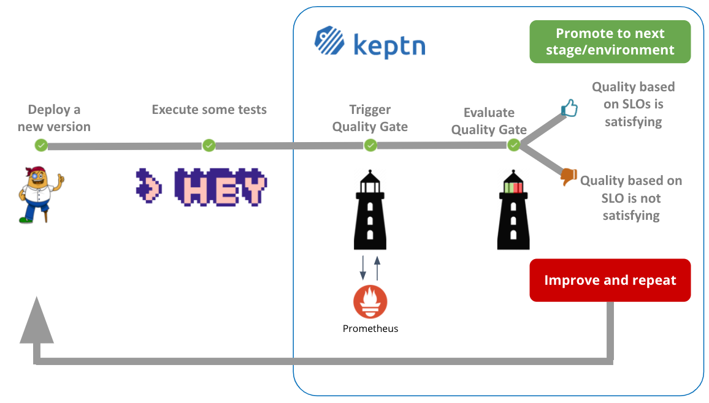
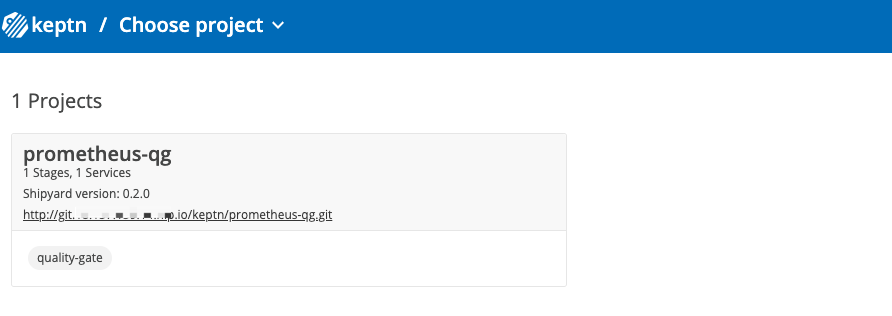
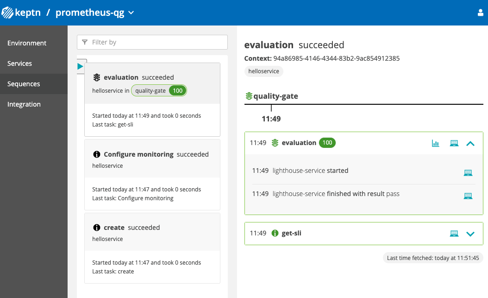
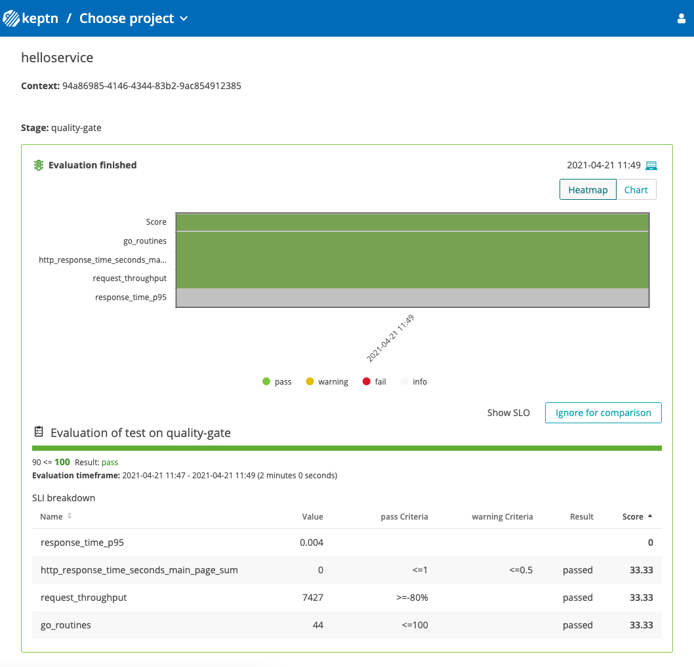
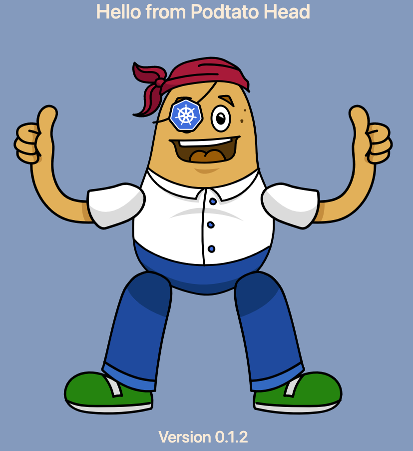
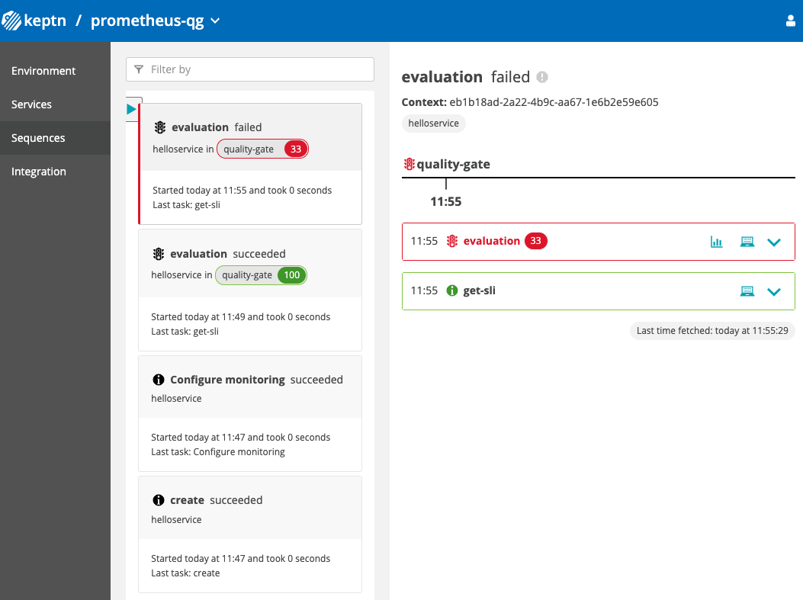
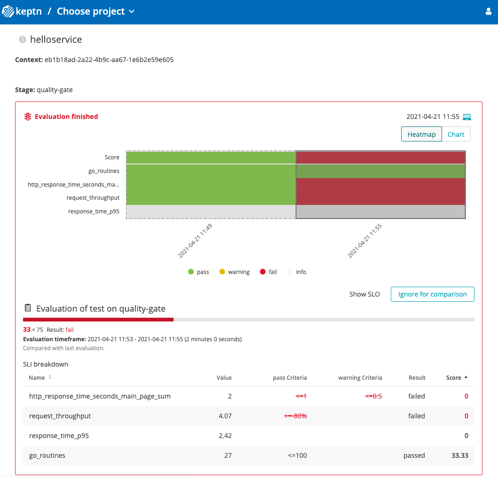
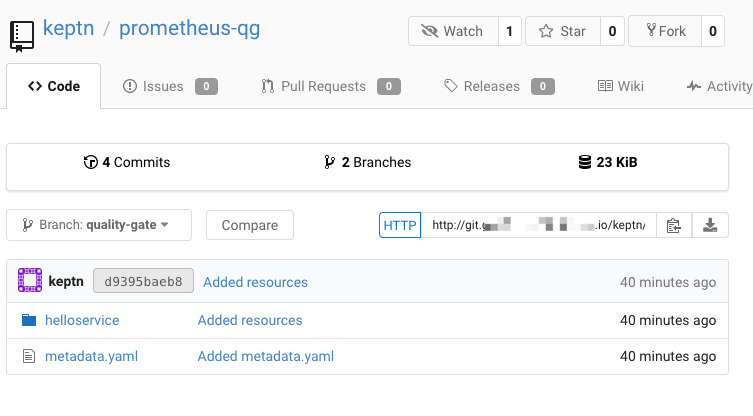

summary: 5 minute installation. All running on K3s with a single line installation. No Kubernetes cluster needed.
level: beginner
id: keptn-quality-gates-prometheus-08
categories: prometheus,quality-gates,k3s
tags: keptn08x,beginner
status: Published 
authors: Jürgen Etzlstorfer
Feedback Link: https://github.com/keptn/tutorials/tree/master/site/tutorials


# Keptn Quality Gates with Prometheus

## Welcome
Duration: 2:00


Let's say you want to use your existing tools to deploy and test your applications - you can still use *Keptn`s Quality Gates* for the evaluation of Service Level Objectives (SLOs).

*A brief recap of SLO and SLI:* A Service Level Objective (SLO) is a target value or range of values for a service level that is measured by a Service Level Indicator (SLI). An SLI is a carefully defined quantitative measure of some aspect of the level of service that is provided. 

Positive
: For more information about SLO and SLI, please take a look at [Quality Gates with Keptn](https://keptn.sh/docs/concepts/quality_gates/).

### What we will cover in this tutorial

- Setup a demo with Prometheus and Keptn
- Trigger Keptn Quality Gate evaluations
- Manage SLOs via the Keptn


Here is what we are going to do in the course of this demo:



## Prerequisites
Duration: 2:00

Everything you need to run for this tutorial is provided on Github and you'll run the whole tutorial (Keptn installation + demos) in a VM. This is not recommended for production use-cases, but it will give you a quick and easy start to explore Keptn.

### What you need

You should have a Linux machine with at least 2vCPUs and 8GB of RAM, e.g: EC2 t3.large. This tutorial was tested on a EC2 with Amazon Linux, size t3.large instance, if you can bring this one please do so as it will give you a smooth experience.
If you want to run additional tutorials later, e.g: performance testing, continuous delivery .. then we suggest you get a machine with 8vCPUs and 32GB RAM, e.g: EC2 t3.2xlarge.
As we will be accessing Keptn that we install on that machine via HTTP and HTTPS make sure that both ports (80 & 443) are allowed by your firewall.
What we will need is SSH access to this machine and sudo rights so we can execute our scripts.

Here is our checklist:

✅ Large enough Linux VM: EC2 with Amazon Linux, at least of size t3.large recommended
✅ Ports 22, 80 & 443 are open
✅ SSH access and sudo rights

In the following steps, we are making use of resources that are provided on Github. If you want to explore them, have a look at our repo [Keptn on k3s](https://github.com/keptn-sandbox/keptn-on-k3s)!

## Set up the tutorial
Duration: 2:00

Login to your Linux VM and prepare it for this tutorial by executing a couple of pre-requisite steps. 
Let's prepare the machine with all needed utilities.

```
sudo yum update -y
sudo yum install git -y
sudo yum install curl -y
sudo yum install jq -y
sudo yum install tree -y
sudo wget https://github.com/mikefarah/yq/releases/download/v4.2.0/yq_linux_amd64 -O /usr/bin/yq && sudo chmod +x /usr/bin/yq

git clone https://github.com/keptn-sandbox/keptn-on-k3s
cd keptn-on-k3s
git checkout release-0.8.0
```

This will install some tools that we are going to need for the tutorial and already download the tutorial files.

## Install Keptn + demo
Duration: 3:00

Now that we have prepared our machine for the tutorial and also downloaded the needed files, let us go ahead and start the installation script.

We recommend that you are using the following command. However, the Keptn-on-K3s project is in general customizable and can be executed with other parameters as well. Please have a look at the [Keptn-on-K3s Github repo](https://github.com/keptn-sandbox/keptn-on-k3s) for full instructions of all capabilities. As said, for this tutorial we are going to install it with the following command.

Negative
: Please note that we are assuming here that you are running an EC2 instance in the AWS cloud. If that is not the case, please change the "provider" flag to fit your environment.

We need to provide a email address to create a certificate via Let's Encrypt. You can do so via entering your own email address or just copy the line below.
```
export CERT_EMAIL=mykeptntutorial@certemail.com
```

Let's go ahead and install Keptn and the demo:

```
./install-keptn-on-k3s.sh --controlplane --provider aws --with-prometheus --with-demo prometheus --with-gitea --letsencrypt --disable-bridge-auth --use-nip
```

In my tests, the full installation and setup usually takes less than 7 minutes to finish.

While the script is running, let us take a look at the installation flags that we've chosen:

- `--controlplane`: we only install the Keptn control plane as we do not need additional execution plane services (as we only run the Keptn quality gates use case)
- `--provider aws`: with this flag we configure the installation for AWS
- `--with-prometheus`: we will have Prometheus + the Prometheus integrations for Keptn installed 
- `--with-demo prometheus`: we will have a demo application ready to be used with Prometheus installed 
- `--with-gitea`: we will have Gitea - a git user interface in the browser - installed
- `--letsencrypt`: we will have a Let's Encrypt certificate being issued for us installed 
- `--disable-bridge-auth`: we will disable the authentication for Keptn Bridge to be able to access it without password (not recommended for production use cases)

For a full list of installation flags, please have a look at the [keptn-on-k3s GitHub repo](https://github.com/keptn-sandbox/keptn-on-k3s).

Let's move on to the next step while the installation is running!


## While the installation is running
Duration: 2:00

While the installation is running, let's have a look what will be installed.

- **Keptn control plane**: all services of the Keptn control plane are being installed to allow for the quality gate evaluation. This includes also the Keptn Bridge as the UI of Keptn that we are going to use to have a look at the evaluations.

- **Prometheus**: In this demo we are using Prometheus as our monitoring tool and datastore. Therefore, Prometheus will be installed along with the [Prometheus integrations](https://github.com/keptn-contrib/prometheus-service) for Keptn. 

- **Podtatohead demo application**: We are going to use the CNCF [podtatohead demo application](https://github.com/cncf/podtato-head) for this demo with a custom built image that serves our purpose. The demo application will be ready for you after the installation. 

- **Gitea**: A user interface to browse the Keptn managed Git repo will be installed.

- **First run of a quality gate**: To make use of the demo application, Prometheus, and the Keptn quality gates, a first quality gate evaluation will already be triggered. This allows us to already take a look at the first evaluation upon installation.


Once the installation is finished, the final output should look similar to this:

```
#######################################>
# Keptn Deployment Summary
#######################################>
API URL   :      https://keptn.xxx.nip.io/api
Bridge URL:      https://keptn.xxx.nip.io/bridge
Bridge Username:
Bridge Password:
API Token :      xxx
Git Server:      https://git.xxx.nip.io
Git User:        keptn
Git Password:    xxx
The Keptn CLI has already been installed and authenticated. To use keptn here some sample commands
$ keptn status
$ keptn create project myfirstproject --shipyard=./shipyard.yaml

If you want to install the Keptn CLI somewhere else - here the description:
- Install the keptn CLI: curl -sL https://get.keptn.sh | sudo -E bash
- Authenticate: keptn auth  --api-token "xxx" --endpoint "https://keptn.xxx.nip.io/api"

If you want to uninstall Keptn and k3s simply type: k3s-uninstall.sh!
After that also remove the demo files that were downloaded in your local working directory!

Now go and enjoy Keptn!
```

Great - let's move on!

## Explore the first Keptn quality gate evaluation
Duration: 2:00

At the end of the installation output, you will find the URL for accessing the Keptn Bridge. 

```
#######################################>
# Keptn Deployment Summary
#######################################>
API URL   :      https://keptn.xxxx.nip.io/api
Bridge URL:      https://keptn.xxx.nip.io/bridge
Bridge Username:
Bridge Password:
...
```

Open the URL and you will find a project already created for you.



We can navigate via the "Sequence" item on the left to take a look at the first task sequence that Keptn executed and which includes our quality gate evaluation.



By clicking on the "bar chart" icon 📊 in the evaluation tile, it will bring you to the detail screen of the quality gate.



We can see that our first quality gate evaluation scores 100% and all our SLOs are met! 

Positive
: If you want to [learn more about SLIs and SLOs](https://keptn.sh/docs/concepts/quality_gates/) please have a look at our documentation.

The quality gate itself is defined in terms of an `SLO.yaml` file that is stored in the Keptn managed Git repository. 
Here is what it looks like:

```
---
spec_version: '0.1.0'
comparison:
  compare_with: "single_result"
  include_result_with_score: "pass"
  aggregate_function: avg
objectives:
  - sli: http_response_time_seconds_main_page_sum
    pass:
      - criteria:
          - "<=1"
    warning:
      - criteria:
          - "<=0.5"
  - sli: request_throughput
    pass:
      - criteria:
          - ">=-80%"
  - sli: go_routines
    pass:
      - criteria:
          - "<=100"
  - sli: response_time_p95
total_score:
  pass: "90%"
  warning: "75%"
```

As you can see, it comprises a list of objectives along with criteria that have to be satisfied. In the tutorial, the integration of Prometheus and Keptn is already installed, and therefore Keptn knows how to retrieve the data for each of the specified SLIs in this document. 
The mapping is defined in a so called `SLI.yaml`. You will also find this file in the Keptn managed Git repository. Have a look in the `quality-gate` branch of the repo, that you can access via:

```
echo https://$(k3s kubectl get ingress gitea-ingress -n git -ojsonpath='{.spec.rules[0].host}')/keptn/prometheus-qg/src/branch/quality-gate
```


## Deploy a new version
Duration: 2:00

We've prepared a second version of the Podtatohead application for you to evaluate with the Keptn Quality Gates. 
Therefore, let us deploy this alternative version.

Execute the following commands that will deploy the new version.

```
k3s kubectl set image deploy/helloservice server=ghcr.io/podtato-head/podtatoserver:v0.1.2 --record -n prometheus-qg-quality-gate 
```

If you want to take a look, you can retrieve the URL of your application via this command.

```
echo https://$(k3s kubectl get ingress podtato-ingress -n prometheus-qg-quality-gate -ojsonpath='{.spec.rules[0].host}') 
```



Great - let's move on!

## Validate with Keptn Quality Gate
Duration: 2:00

Now, before we are going to evaluate this version, we need to hit it with some load, otherwise the evaluation would not have enough data for it to query.
Therefore, we are going to use the `hey` command line tool for load generation. This tool has been installed during the installation procedure of the tutorial and we can make us of it now.

```
./hey -z 90s -c 10 http://$(k3s kubectl get ingress podtato-ingress -n prometheus-qg-quality-gate -ojsonpath='{.spec.rules[0].host}')
```

This command will send requests to the publicly available endpoint of our application for 90 seconds.

Once it is finished we can trigger an evaluation of the Keptn Quality Gate via the Keptn CLI.

```
keptn trigger evaluation --project=prometheus-qg --stage=quality-gate --service=helloservice --timeframe=3m
```


Now it is time to have a look at the quality gate evaluation. Switch back to your Keptn Bridge and you'll see that a new evaluation event is coming in.



This time, the evaluation score is way lower than the 100% we scored earlier. We can have a look at the detailed evaluation by clicking on the 📊 icon in the evaluation tile.

We can see that this version is way slower than the previous one. Neither the `throughput` nor the `http_response_time_seconds_main_page_sum` could match our SLOs and thus the score is not sufficient to give it a "pass" from Keptn. 



Now you can experiment with defining your own thresholds for the SLOs!
Access the Git repo via the following command. The credentials to it have been given at the end of your Keptn installation: by default your user is `keptn` and the password is `keptn#R0cks`. 

```
echo https://$(k3s kubectl get ingress gitea-ingress -n git -ojsonpath='{.spec.rules[0].host}')/keptn/prometheus-qg/src/branch/quality-gate
```



You can also trigger new load tests via `hey` - you can find all commands earlier in this tutorial. 
After each load execution make sure to trigger the Keptn quality gates via `keptn trigger evaluation`. You can also adjust the timeframe for the evaluation, in case you are running tests that are taking longer, you also want to consider this in the timeframe of the evaluations.

**Now have fun with evaluating the application with SLO-based quality gates!**


## Troubleshooting

We've made sure this tutorial is thoroughly tested on the infrastructure listed in the beginning of this tutorial. However, if you run into any issues, here are some tips for you.

### Time-outs

If you run into any timeout issues, that might be due to the following reasons:

- Rate limiting of Dockerhub: the tutorial pulls images from Dockerhub which has a rate limit. Only 100 pulls within a time period of 6 hours are allowed. If install and uninstall this tutorial multiple times or if you are sharing your IP with others, you might run into this limit. Potentials solutions are to wait a bit and try again or to try from another machine with a different IP.

- Certificate not issued: Sometime the issuing of the Let's Encrypt certificate takes longer than the 5 minutes the installation expects. If so, you can uninstall the tutorial with `k3s-uninstall.sh` and give it a fresh installation. Usually the second or third attempts are way quicker and this should work.

### Get help

Please don't hesitate to reach out in our Slack channel to get help! 
Join us [in the Keptn slack](https://slack.keptn.sh) and ask your questions in the #help channel. We are happy to help!


{{ snippets/08/community/feedback.md }}
